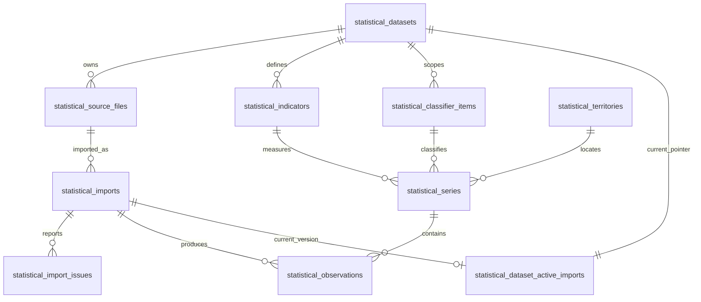

# ПРИЗМА Индексы — БЛОК 2.3A: аудит XLSX и модель импорта

Статус: проектирование завершено по фактическому workbook; реализация 2.3B не начата.

Дата аудита: 2026-08-09.

## 1. Границы и метод аудита

Проанализирован только файл:

- `Proizvoditeli_Ind_tov_06-2026.xlsx`;
- размер: `25 217 390` байт;
- SHA-256: `f233b55e8c00ff378e4dfaf6d870d057f724dbe9ec0e3b49fca3ea8c27b0b691`;
- workbook обновлён внутри источника 24.07.2026;
- установленная версия `phpoffice/phpspreadsheet`: `5.4.0`.

Файл исследован read-only. Workbook не сохранялся и не модифицировался. Сначала через
PhpSpreadsheet выполнены `listWorksheetInfo()`, выборочная загрузка листов и анализ
cell type/number format/merged cells. Затем OOXML был потоково прочитан через
`ZipArchive` + `XMLReader`, чтобы не создавать в памяти объектную модель миллионов
ячеек. Это второй read-only слой аудита, а не будущий обход PhpSpreadsheet.

Набор `ipc_mes_*` не использовался. Production DB, source files и dataset не читались и
не изменялись. В 2.3A не создавались миграции, модели, importer, API или observations.

Ниже разделены:

- **Наблюдаемое** — подтверждено в предоставленном XLSX или текущем repository;
- **Рекомендация** — решение для будущего БЛОКА 2.3B;
- **Не подтверждено** — то, чего нет в этом workbook и что нельзя объявлять стабильным
  контрактом других наборов Росстата.

## 2. Фактическая карта workbook

### 2.1 Общая структура

- 28 листов: `Содержание` и `1`–`27`;
- все 28 листов имеют state `visible`; hidden/veryHidden листов нет;
- formulas: `0` во всём workbook;
- единственный повтор заголовка `Код товара на основе ОКПД2` на каждом табличном листе
  — исходная строка 4; повторных headers внутри data range нет;
- листы 2021–2025 содержат январь–декабрь, листы 2026 — январь–июнь;
- товар находится в колонке A, код на основе ОКПД2 — в B, значения — с C;
- 2021–2023: одна строка содержит товар, код и все значения, территория РФ задана
  заголовком листа;
- 2024–2026: commodity row содержит A=name/B=code, за ней идут territory rows; у
  territory rows название находится в A, B пустая, значения начинаются с C;
- в каждом исследованном блоке с корректным кодом на поддерживаемых листах 2024–2026
  строка `Российская Федерация` найдена до начала следующего commodity block;
- служебная сноска с 2022 года сообщает об исключении новых территорий из статистики;
- merged cells используются только для title/basis/footer, не для observation values.

### 2.2 Карта каждого meaningful sheet

`Data rows` — фактическая область данных до footer. `C:N` означает январь–декабрь,
`C:H` — январь–июнь.

| Sheet | Used range | Год/диапазон | Comparison basis | Header rows | Data rows | Months/years | Commodity/code | Territory/value model | Notes |
|---|---:|---|---|---:|---:|---|---|---|---|
| Содержание | A1:M49 | workbook index | service | 2, 4 | — | — | — | — | 18 merges; карта листов; updated 24.07.2026 |
| 1 | A2:M808 | 1998–2009 | к декабрю предыдущего года | 2, 4, 5 | 6–808 | B:M = years | A, без надёжного code column | РФ implicit, value same row | legacy, ignored |
| 2 | A2:H867 | 2010–2016 | к декабрю предыдущего года | 2–4 | 5–865 | B:H = years | A, без code column | РФ implicit, value same row | legacy, ignored; footer 867 |
| 3 | A1:N1395 | 2017–2025 | к декабрю предыдущего года | 2–4 | 5–1368 | C:K = years | A/B | РФ implicit, value same row | annual historical; footers 1370–1371; ignored |
| 4 | A1:N1216 | 2021 | к предыдущему месяцу | 2–4 | 5–1216 | C:N | A/B | РФ implicit, value same row | **supported**; 1 145 commodities |
| 5 | A1:N1216 | 2021 | к декабрю предыдущего года | 2–4 | 5–1216 | C:N | A/B | РФ implicit, value same row | ignored |
| 6 | A1:N1216 | 2021 | к соответствующему месяцу прошлого года | 2–4 | 5–1216 | C:N | A/B | РФ implicit, value same row | ignored |
| 7 | A1:N1216 | 2021 | с начала года к соответствующему периоду прошлого года | 2–4 | 5–1216 | C:N | A/B | РФ implicit, value same row | ignored |
| 8 | A2:N1231 | 2022 | к предыдущему месяцу | 2–4 | 5–1229 | C:N | A/B | РФ implicit, value same row | **supported**; 1 157 commodities; footer 1231 |
| 9 | A2:P1231 | 2022 | к декабрю предыдущего года | 2–4 | 5–1229 | C:N | A/B | РФ implicit, value same row | ignored; used range has service/styled P column |
| 10 | A2:N1231 | 2022 | к соответствующему месяцу прошлого года | 2–4 | 5–1229 | C:N | A/B | РФ implicit, value same row | ignored |
| 11 | A2:N1231 | 2022 | с начала года к соответствующему периоду прошлого года | 2–4 | 5–1229 | C:N | A/B | РФ implicit, value same row | ignored |
| 12 | A1:N1229 | 2023 | к предыдущему месяцу | 2–4 | 5–1226 | C:N | A/B | РФ implicit, value same row | **supported**; 1 154 commodities; footer 1228 |
| 13 | A1:N1229 | 2023 | к декабрю предыдущего года | 2–4 | 5–1226 | C:N | A/B | РФ implicit, value same row | ignored |
| 14 | A1:N1229 | 2023 | к соответствующему месяцу прошлого года | 2–4 | 5–1226 | C:N | A/B | РФ implicit, value same row | ignored |
| 15 | A1:N1229 | 2023 | с начала года к соответствующему периоду прошлого года | 2–4 | 5–1226 | C:N | A/B | РФ implicit, value same row | ignored |
| 16 | A2:N24166 | 2024 | к предыдущему месяцу | 2–4 | 5–24164 | C:N | A/B block header | explicit РФ/FO/subjects rows | **supported only РФ**; 1 164 coded blocks |
| 17 | A1:O24166 | 2024 | к декабрю предыдущего года | 2–4 | 5–24164 | C:N | A/B block header | explicit territories | ignored |
| 18 | A1:O24166 | 2024 | к соответствующему месяцу прошлого года | 2–4 | 5–24164 | C:N | A/B block header | explicit territories | ignored |
| 19 | A1:N24166 | 2024 | с начала года к соответствующему периоду прошлого года | 2–4 | 5–24164 | C:N | A/B block header | explicit territories | ignored |
| 20 | A1:N24701 | 2025 | к предыдущему месяцу | 2–4 | 5–24650 | C:N | A/B block header | explicit РФ/FO/subjects rows | **supported only РФ**; 1 197 coded blocks |
| 21 | A1:N24665 | 2025 | к декабрю предыдущего года | 2–4 | 5–24650 | C:N | A/B block header | explicit territories | ignored |
| 22 | A1:N24665 | 2025 | к соответствующему месяцу прошлого года | 2–4 | 5–24650 | C:N | A/B block header | explicit territories | ignored |
| 23 | A1:N24666 | 2025 | с начала года к соответствующему периоду прошлого года | 2–4 | 5–24650 | C:N | A/B block header | explicit territories | ignored |
| 24 | A1:H24779 | 2026 | к предыдущему месяцу | 2–4 | 5–24775 | C:H | A/B block header | explicit РФ/FO/subjects rows | **supported only РФ**; 1 200 coded blocks |
| 25 | A1:H24781 | 2026 | к декабрю предыдущего года | 2–4 | 5–24775 | C:H | A/B block header | explicit territories | ignored |
| 26 | A1:H24780 | 2026 | к соответствующему месяцу прошлого года | 2–4 | 5–24775 | C:H | A/B block header | explicit territories | ignored |
| 27 | A1:H24780 | 2026 | с начала года к соответствующему периоду прошлого года | 2–4 | 5–24775 | C:H | A/B block header | explicit territories | ignored |

Фактические basis groups:

- A / `previous_month`: 4, 8, 12, 16, 20, 24;
- B / `previous_december`: 1–3 и 5, 9, 13, 17, 21, 25;
- C / `year_over_year`: 6, 10, 14, 18, 22, 26;
- D / `year_to_date_year_over_year`: 7, 11, 15, 19, 23, 27;
- E / service: `Содержание`.

Классификация должна исходить из нормализованного title/basis/header content, а не из
номера листа. Номера выше — только фактическая карта этого SHA-256.

## 3. Сравнение структуры 2021–2026

| Year | Sheets | Topology | Month columns | Coded commodities on supported sheet | РФ representation | Structural differences |
|---:|---|---|---|---:|---|---|
| 2021 | 4–7 | flat | C:N, 12 | 1 145 | implicit in title | no footer; 2 merged title/basis ranges |
| 2022 | 8–11 | flat | C:N, 12 | 1 157 | implicit in title | footer `1)`; two rich-text footnoted values on sheet 8 |
| 2023 | 12–15 | flat | C:N, 12 | 1 154 | implicit in title | footer rows 1228–1229 |
| 2024 | 16–19 | commodity + territories | C:N, 12 | 1 164 | explicit inside every coded block | rows increase to ~24k; FO/subjects appear |
| 2025 | 20–23 | commodity + territories | C:N, 12 | 1 197 | explicit inside every coded block | wording has whitespace/typo variants; larger catalog |
| 2026 | 24–27 | commodity + territories | C:H, 6 | 1 200 | explicit inside every coded block | partial year January–June |

Observed header positions are stable at rows 2–4, but parser must find them by content.
All supported sheets have A=name, B=code and month headings from C. The number of value
columns is not stable: 12 for completed years and 6 for the current 2026 file.

No formulas were found. Current data cells normally use Excel number format `0.00`;
older annual sheets use `0.0`. OOXML contains IEEE-754 serialization tails such as
`75.849999999999994` while Excel displays `75.85`.

Missing markers observed in ignored historical sheets:

- Unicode ellipsis `…`: present (for example 613 cells on sheet 1, 112 on sheet 2,
  1 277 on sheet 3);
- three ASCII dots `...`: present (464 cells on sheet 3);
- hyphen `-`: not found in this workbook;
- structurally blank cells are common, but among supported РФ/previous-month candidate
  value cells there are no blank/missing values.

The absence of `-` in this file is not proof that future revisions never use it.

## 4. Контрольный товар `31.02.10.140`

### 4.1 Где найден

`Наборы кухонной мебели` / `31.02.10.140` найден:

- на annual sheet 3, row 1270 (`A1270`, `B1270`);
- на каждом monthly sheet 4–7, row 1124;
- на каждом monthly sheet 8–11, row 1136;
- на каждом monthly sheet 12–15, row 1135;
- на каждом regional sheet 16–19, commodity row 20373 и РФ row 20374;
- на каждом regional sheet 20–23, commodity row 20850 и РФ row 20851;
- на каждом regional sheet 24–27, commodity row 20919 и РФ row 20920.

На листах 2021–2023 отдельной territory cell нет: РФ подтверждается title листа. На
листах 2024–2026 territory cell соответственно `A20374`, `A20851`, `A20920`.

Annual sheet 3 (`previous_december`) содержит значения 2017–2025:
`126.4, 103.2, 105.5, 102.3, 116, 103.6, 112.5, 115.1, 105.8`.

### 4.2 Все monthly values контрольного товара

Порядок значений: январь→декабрь; для 2026 — январь→июнь. Значения не
пересчитывались и приведены из workbook.

| Year | Sheet | Basis | Value row | Values |
|---:|---:|---|---:|---|
| 2021 | 4 | previous_month | 1124 | 109.51, 105.82, 99.68, 102.42, 83.05, 111.24, 99.14, 93.95, 88.47, 100.28, 127.54, 100.68 |
| 2021 | 5 | previous_december | 1124 | 109.51, 115.89, 115.51, 118.3, 98.25, 109.3, 108.36, 101.8, 90.06, 90.32, 115.2, 115.98 |
| 2021 | 6 | year_over_year | 1124 | 101.44, 96.29, 111.51, 95.17, 98.23, 93.91, 109.18, 85.65, 76.55, 75.849999999999994, 96.33, 115.98 |
| 2021 | 7 | year_to_date_year_over_year | 1124 | 101.44, 98.72, 102.71, 100.66, 100.22, 99.13, 100.42, 98.45, 95.89, 93.78, 94.02, 95.65 |
| 2022 | 8 | previous_month | 1136 | 94.42, 100.17, 114.71, 100.5, 102.16, 93.68, 99.71, 99.84, 100.14, 99.96, 100.54, 99.1 |
| 2022 | 9 | previous_december | 1136 | 94.42, 94.58, 108.5, 109.04, 111.39, 104.36, 104.06, 103.89, 104.04, 104, 104.56, 103.62 |
| 2022 | 10 | year_over_year | 1136 | 109.56, 113.2, 129.16999999999999, 126.93, 140.72, 125.35, 124.98, 128.38999999999999, 133.76, 128.26, 120.68, 103.62 |
| 2022 | 11 | year_to_date_year_over_year | 1136 | 109.56, 111.35, 117.25, 119.7, 123.67, 123.95, 124.1, 124.62, 125.57, 125.84, 125.35, 123.2 |
| 2023 | 12 | previous_month | 1135 | 98.89, 100.67, 100, 100.15, 99.98, 100.45, 99.91, 109.42, 101.24, 101.49, 99.91, 100.13 |
| 2023 | 13 | previous_december | 1135 | 98.89, 99.55, 99.55, 99.7, 99.69, 100.13, 100.04, 109.46, 110.82, 112.47, 112.36, 112.51 |
| 2023 | 14 | year_over_year | 1135 | 110.18, 110.69, 92.63, 92.39, 91.47, 100.99, 100.76, 110.12, 110.96, 112.76, 111.89, 112.51 |
| 2023 | 15 | year_to_date_year_over_year | 1135 | 110.18, 110.43, 103.77, 100.66, 98.68, 99.06, 99.3, 100.64, 101.78, 102.87, 103.7, 104.43 |
| 2024 | 16 | previous_month | 20374 | 106.81, 100.19, 99.81, 100.16, 99.89, 100, 99.87, 107.38, 99.92, 100.52, 100.02, 99.95 |
| 2024 | 17 | previous_december | 20374 | 106.81, 107.02, 106.82, 106.98, 106.87, 106.86, 106.73, 114.61, 114.52, 115.11, 115.14, 115.07 |
| 2024 | 18 | year_over_year | 20374 | 121.29, 121.1, 120.87, 120.98, 120.84, 120.62, 120.53, 115.87, 115.26, 115.1, 115.24, 115.07 |
| 2024 | 19 | year_to_date_year_over_year | 20374 | 121.29, 121.2, 121.09, 121.06, 121.02, 120.95, 120.89, 120.2, 119.6, 119.11, 118.73, 118.4 |
| 2025 | 20 | previous_month | 20851 | 100.12, 100.05, 104.96, 100, 100, 100.62, 100.01, 100, 100, 100, 99.9, 100.07 |
| 2025 | 21 | previous_december | 20851 | 100.12, 100.18, 105.14, 105.14, 105.14, 105.8, 105.81, 105.81, 105.81, 105.81, 105.7, 105.77 |
| 2025 | 22 | year_over_year | 20851 | 109.01, 109, 114.43, 114.28, 114.21, 114.93, 114.93, 105.82, 105.82, 105.82, 105.7, 105.77 |
| 2025 | 23 | year_to_date_year_over_year | 20851 | 109.01, 109, 110.81, 111.68, 112.19, 112.65, 112.97, 112.01, 111.28, 110.7, 110.22, 109.83 |
| 2026 | 24 | previous_month | 20920 | 109.24, 100, 100, 99.3, 100.27, 99.99 |
| 2026 | 25 | previous_december | 20920 | 109.24, 109.24, 109.24, 108.48, 108.77, 108.76 |
| 2026 | 26 | year_over_year | 20920 | 114.93, 114.93, 109.69, 108.92, 109.22, 108.77 |
| 2026 | 27 | year_to_date_year_over_year | 20920 | 114.93, 114.93, 113.12, 112.05, 111.47, 111.01 |

## 5. Parser grammar первого importer

Рекомендуется dataset-specific grammar, а не набор жёстких координат.

1. **Workbook fingerprint.** Проверить dataset code, SHA-256, workbook title и наличие
   набора листов. Номер листа не является типом.
2. **Header discovery.** В верхнем ограниченном окне найти строку с текстом
   `Код товара` + `ОКПД2`; определить name column слева, code column и month cells справа.
3. **Year.** Из нормализованного title получить один `YYYY г.`. Annual ranges и
   неоднозначные годы не поддерживаются первым importer.
4. **Comparison basis.** Нормализовать whitespace/`ё`/регистр и классифицировать basis
   только по смысловым фразам. Для import допускается только `previous_month`.
5. **Month map.** Распознать русские полные названия месяцев, проверить уникальность,
   естественный порядок и отсутствие дыр внутри заявленного диапазона. Не считать C
   январём без header.
6. **Commodity start.** Строка начинает block, если code cell соответствует
   Unicode-aware grammar `^\d{2}(?:\.\d+)+(?:\.АГ)?$`, name cell непустая. Numeric
   code и локальный код Росстата с `.АГ` — самостоятельные classifier items. Суффикс
   не удаляется, не наследует предыдущий товар и хранится в `item_code`.
7. **Flat grammar (2021–2023).** Title обязан однозначно задавать РФ; month values
   находятся в commodity row. Следующая строка с code завершает предыдущую.
8. **Regional grammar (2024–2026).** После commodity row читать строки с пустым code до
   следующего commodity. Найти нормализованное точное имя `Российская Федерация`;
   значения брать только из этой строки. FO/subjects учитывать в preview statistics,
   но не импортировать.
9. **Numeric value.** Принимать numeric cell или строго известный rich-text шаблон со
   сноской. Формулы в supported cells — fatal даже при наличии cached value.
10. **Footnoted numeric.** Фактические `M812="97,511)"` и `M816="94,471)"` означают
    `97,51`/`94,47` + marker `1)`. Допускается только anchored parser для известной
    сноски и decimal comma; общий strip non-digits запрещён.
11. **Missing value.** После trim и Unicode normalization распознавать exact tokens
    `...`, `…`, `-` и blank. Не преобразовывать marker в ноль.
12. **Block end.** Следующий valid code row или конец data range. Footer определяется
    по содержимому (`1)`, `Данных не имеется`), а не по последнему номеру строки.

Observed fixed rules A/B/C are стабильны в 2021–2026 этого файла, но остаются
validation expectations конкретного importer version, а не универсальными правилами
Росстата.

## 6. Scope первого importer и фактический preview volume

Импортировать:

- sheets 4, 8, 12, 16, 20, 24 по фактическому workbook;
- years `>= 2021`;
- frequency `monthly`;
- comparison basis `previous_month`;
- только coded commodity items;
- только РФ;
- numeric и missing observations;
- все товары, не только мебель.

Игнорировать, но показывать в preview:

- annual sheets 1–3;
- previous-December, YoY и YTD-YoY sheets;
- FO и subjects;
- периоды до 2021;
- service/footer rows;
- иные datasets, CPI и средние цены.

| Provider code kind | Commodity occurrences | Unique item codes | Candidate observations | Ordinary numeric | Special footnoted numeric | Missing |
|---|---:|---:|---:|---:|---:|---:|
| `numeric` | 7 017 | 1 251 | 77 004 | 77 002 | 2 | 0 |
| `rosstat_local_ag` | 418 | 76 | 4 578 | 4 578 | 0 | 0 |
| **Total** | **7 435** | **1 327** | **81 582** | **81 580** | **2** | **0** |

Classifier identity остаётся `(dataset_id, classifier_code, item_code)`, поэтому base
code и тот же code с `.АГ` являются разными items внутри `okpd2_based`.

## 7. Proposed entities

### 7.1 Нужные таблицы

1. `statistical_indicators` — semantic measure внутри dataset.
2. `statistical_classifier_items` — dataset-scoped provider vocabulary.
3. `statistical_territories` — переиспользуемый territory registry.
4. `statistical_imports` — отдельная session/attempt поверх source file.
5. `statistical_import_issues` — fatal/warning/informational audit.
6. `statistical_series` — стабильный dimension tuple.
7. `statistical_observations` — immutable values конкретного import.
8. `statistical_dataset_active_imports` — current published import pointer.

`statistical_import_items` в MVP не нужен: он дублировал бы classifier items и
observations. Commodity-level проблема хранится в `statistical_import_issues` с sheet,
row, code и details. Если позже понадобится отдельный row-level review workflow, таблица
может быть добавлена без изменения observation contract.

### 7.2 `statistical_indicators`

Recommended fields:

- `id`, `public_id` UUID;
- `dataset_id` FK restrict;
- `code` (`producer_price_index`), `name`, `description` nullable;
- `data_kind` (`index`);
- `metadata_json` nullable;
- timestamps;
- unique `(dataset_id, code)`.

`frequency`, `comparison_basis`, `unit` не включать в name и не фиксировать на
indicator: это dimensions серии. Существующие dataset fields остаются совместимыми
catalog defaults; 2.3B не должен разрушительно переносить или удалять их.

### 7.3 `statistical_classifier_items`

- `id`, `public_id` UUID;
- `dataset_id` FK restrict;
- `classifier_code` = `okpd2_based`;
- `item_code` string;
- `name`, `normalized_name`;
- `parent_item_id` nullable self-FK restrict;
- `valid_from`, `valid_to` nullable;
- `metadata_json` nullable;
- timestamps;
- unique `(dataset_id, classifier_code, item_code)`.

Рекомендация: dataset-scoped registry. Workbook говорит «код товара **на основе**
ОКПД2», поэтому нельзя объявлять записи canonical OKPD2. В будущем nullable link на
отдельный canonical classifier registry можно добавить, не меняя исходный item code.

### 7.4 `statistical_territories`

- `id`, `public_id` UUID;
- stable internal `code` (`RU` для РФ), unique;
- `name`, `normalized_name`;
- `type` (`country`, позже `federal_district`, `region`);
- `parent_id` nullable self-FK;
- `provider_code` nullable;
- `metadata_json` nullable;
- timestamps.

В первом import создаётся/используется только РФ. Региональные названия попадают лишь
в preview counts. Если появятся несколько providers, provider codes следует вынести в
mapping table, а не добавлять несколько nullable columns.

### 7.5 `statistical_imports`

- `id`, `public_id` UUID;
- `dataset_id`, `source_file_id` FKs restrict;
- `importer_code`, `importer_version`;
- `attempt_no`, `retry_of_import_id` nullable;
- `status`;
- nullable unique `successful_dedupe_key` CHAR(64);
- `started_at`, `finished_at`, `published_at`, `superseded_at`, `failed_at` nullable;
- rows/observations/warnings/errors counters из задания;
- `initiated_by_user_id`, `published_by_user_id` nullable FKs null-on-delete;
- `supersedes_import_id` nullable self-FK restrict;
- `failure_code`, `failure_message` nullable;
- `validation_summary_json`, `metadata_json` nullable;
- timestamps;
- unique `(source_file_id, importer_code, importer_version, attempt_no)`.

`successful_dedupe_key = SHA-256(source_file_id + importer_code + importer_version)`
заполняется только при переходе в `ready_for_publish` и никогда не очищается. MySQL
допускает много NULL в unique index: failed retries возможны, второй successful import
того же file/version блокируется БД.

### 7.6 `statistical_import_issues`

- `id`, `import_id` FK cascade only when deleting an unpublished/failed import;
- `severity`: `fatal|warning|informational`;
- stable `code`, `message`;
- `sheet_name`, `source_row`, `source_column`, `classifier_item_code` nullable;
- `details_json` nullable;
- timestamp.

### 7.7 `statistical_series`

- `id`, `public_id` UUID;
- `dataset_id`, `indicator_id`, `classifier_item_id`, `territory_id`;
- `frequency` (`monthly`);
- `comparison_basis` (`previous_month`);
- `unit_code` (`percent`);
- timestamps;
- unique dimension tuple из раздела 16.

### 7.8 `statistical_observations`

- `id` BIGINT; per-observation UUID в MVP не нужен;
- `import_id`, `series_id` FKs restrict;
- `period_start` DATE;
- `value` DECIMAL(20,10) nullable;
- `missing_reason` nullable;
- `source_sheet_name` varchar(128);
- `source_row` unsigned integer;
- `source_column` varchar(4);
- `source_value_raw` varchar(255) nullable;
- `source_number_format` varchar(64) nullable;
- `normalization_code` nullable (`numeric`, `binary_tail`, `footnote_1`, `missing_*`);
- `metadata_json` nullable only for exceptional parser facts;
- `created_at`; observations immutable, `updated_at` не требуется.

`cell_address` выводится из column+row и отдельно не хранится. Binary workbook остаётся
в `statistical_source_files`.

### 7.9 `statistical_dataset_active_imports`

- `id`, `public_id` UUID;
- `dataset_id` unique FK restrict;
- `import_id` unique FK restrict;
- `activated_by_user_id` nullable FK null-on-delete;
- `activated_at`, timestamps.

Это pointer текущей опубликованной data version, отдельный от active source-file pointer.

## 8. ER diagram



## 9. Import lifecycle

Recommended persisted lifecycle:

```text
pending -> importing -> validating -> ready_for_publish -> published -> superseded
   |           |            |
   +-----------+------------+-------------------------------> failed
```

- `pending`: durable request created; executor may be synchronous initially or queued;
- `importing`: structure parsed and observations inserted into an isolated transaction;
- `validating`: uniqueness, counts, completeness and provenance checks;
- `ready_for_publish`: data complete but invisible to user calculations;
- `published`: admin-confirmed current data version;
- `superseded`: retained historical publication;
- `failed`: terminal attempt with no committed observations.

Отдельный `analyzing` status не нужен: analyze/preview stateless и не создают import.
`ready_for_publish` нужен обязательно, чтобы parse не публиковал official data
автоматически и будущий UI имел явное действие «Опубликовать».

Import row создаётся до data transaction. Observations/series resolution выполняются в
одной транзакции; при ошибке она откатывается, после чего import row переводится в
`failed`. Это сохраняет failure audit без partial observations.

## 10. Observation model и query будущего расчёта

Conceptual record:

```text
series = dataset + indicator + classifier item + territory + monthly
         + previous_month + percent
period_start = 2026-06-01
value = 99.9900000000
import = published import UUID
source = sheet 24, row 20920, column H
```

Цепочка читается понятным запросом:

```sql
WHERE import_id = :calculation_import_id
  AND series_id = :series_id
  AND period_start > :start_period
  AND period_start <= :end_period
ORDER BY period_start
```

Перед расчётом сервис обязан проверить непрерывность ожидаемых месяцев и отсутствие
NULL. Пропуск нельзя незаметно исключать из compound chain.

## 11. Решение по `statistical_series`

**Рекомендация: series нужна.** В текущем preview 81 582 observations повторяли бы один
и тот же dimension tuple в каждой строке. Series:

- даёт стабильный объект для поиска и chain query;
- отделяет semantic dimensions от конкретной import revision;
- упрощает uniqueness observations;
- позволяет одной серии иметь immutable values разных imports.

Альтернатива — хранить все dimensions в observations. Она уменьшает число таблиц, но
раздувает storage/indexes, усложняет revision comparison и создаёт риск расходящихся
строковых dimensions. Для этого dataset trade-off хуже.

## 12. Period model и temporal semantics

**Рекомендация:** один `period_start DATE`, первый день периода. Для monthly
`2026-06` хранится как `2026-06-01`. Frequency находится в series.

Не хранить одновременно обязательные `period_year`, `period_month` и DATE: это создаёт
три источника истины. API сериализует monthly period как `YYYY-MM`. Quarterly/yearly
series позже используют первый день квартала/года без универсального temporal engine.

Для `previous_month` observation периода `2024-02` означает отношение февраля к январю.
Если исходная стоимость относится к январю 2024 и приводится к июню 2026, chain имеет
границы `(2024-01, 2026-06]`: начинается с February 2024 / January 2024 и заканчивается
June 2026 / May 2026. Observation января 2024 не включается. Будущий calculation record
должен явно хранить start/end period и выбранный import, а UI — объяснять эту семантику.

## 13. Precision policy

**Рекомендация:** normalized `DECIMAL(20,10)`, не FLOAT/DOUBLE.

Факты workbook:

- display format актуальных листов обычно `0.00`;
- обычные значения содержат 0–2 значимых decimal places;
- raw OOXML иногда содержит 14–15 знаков из-за IEEE-754 tails;
- две cells представлены rich text с decimal comma + footnote.

Normalization:

1. сохранить исходную lexical строку в `source_value_raw`;
2. для numeric cell получить shortest round-trip decimal representation IEEE double;
3. если лишний tail исчезает (`75.849999999999994` → `75.85`), записать
   `normalization_code=binary_tail`;
4. не округлять значение только потому, что format показывает два знака;
5. если после canonicalization остаётся более 10 fractional digits — fatal
   `precision_exceeds_storage`, пока precision не согласована;
6. rich text разбирать только известным anchored rule с сохранением marker;
7. display value формировать отдельно, не использовать его как единственный source.

DECIMAL(12,6) был бы компактнее, но не даёт достаточного резерва для других official
indices. DECIMAL(20,10) остаётся точным и не создаёт существенного storage cost при
объёме MVP.

## 14. Missing-value policy

**Рекомендация:** создавать observation с `value=NULL` и обязательным
`missing_reason`, а не пропускать строку.

Причины: `blank`, `not_available` (`...`/`…`), `not_applicable` (`-`, если он появится),
`unknown_marker` запрещён к публикации до ручной классификации. Raw marker и cell
provenance сохраняются.

Это позволяет доказать полноту парсинга, показать точное место разрыва и отличить
«ячейка отсутствовала» от «importer её не увидел». Calculation chain с NULL завершается
ошибкой `incomplete_observation_chain`, а не даёт неверный коэффициент.

В фактических 81 582 supported candidates missing observations нет. Policy нужна для
следующих файлов и уже наблюдаемых historical markers.

## 15. Provenance

Для каждой observation хранить:

- `source_file_id` транзитивно через immutable import;
- `import_id` непосредственно;
- `sheet_name`, `source_row`, `source_column`;
- `source_value_raw`, `source_number_format`, `normalization_code`;
- series dimensions и period;
- importer code/version на import;
- source SHA-256 на существующем source file.

Профессиональный отчёт сможет вывести provider/dataset, original filename и SHA-256,
import public ID/version, sheet/cell, period и normalized value. Binary не дублируется.
Будущий saved calculation обязан хранить `statistical_import_id`, series IDs и snapshots
названия/кода товара, чтобы label changes не меняли старый документ.

## 16. Uniqueness и idempotency

Observation DB uniqueness:

```text
UNIQUE(import_id, series_id, period_start)
```

Series uniqueness:

```text
UNIQUE(dataset_id, indicator_id, classifier_item_id, territory_id,
       frequency, comparison_basis, unit_code)
```

Importer success uniqueness обеспечивается nullable `successful_dedupe_key`. Запуск:

1. взять application/advisory lock по file+importer+version;
2. если успешный import уже есть — вернуть его, не создавать observations;
3. failed attempt допускает новый `attempt_no`;
4. при переходе в ready установить dedupe key; unique violation трактовать как
   idempotent race, а не создавать дубль.

## 17. Publication, revision и воспроизводимость

Publication выполняется отдельной DB transaction:

1. lock `statistical_dataset_active_imports` по dataset;
2. проверить status `ready_for_publish`, dataset/source-file consistency и active source
   file policy;
3. текущий published import, если есть, перевести в `superseded`;
4. новый import перевести в `published`, записать `supersedes_import_id`;
5. атомарно заменить current pointer.

Новая исправленная версия файла создаёт source file B → import B → observations B.
Никакие observations A не обновляются и не удаляются. Новые расчёты получают pointer B;
старые расчёты продолжают ссылаться на import A. Source-file lifecycle и import
lifecycle остаются независимыми.

Отдельная aggregate `statistical_publications` пока не нужна: первый dataset публикуется
одним полным workbook/import. Если позднее одна публикация будет состоять из нескольких
source files/imports, такую entity можно добавить над imports без переписывания
observations.

## 18. Importer interface

Контракт уровня domain/application:

```php
interface StatisticalSourceImporter
{
    public function code(): string;
    public function version(): string;
    public function supports(StatisticalDataset $dataset, StatisticalSourceFile $file): SupportDecision;
    public function analyze(StatisticalSourceFile $file): WorkbookAnalysis;
    public function preview(StatisticalSourceFile $file, PreviewOptions $options): ImportPreview;
    public function import(StatisticalSourceFile $file, ImportContext $context): StatisticalImport;
}
```

Первая реализация: `ProducerPriceIndicesByProductImporter`. Она привязана к dataset code
`producer_price_indices_by_product`; универсальный parser Росстата не создаётся.
DTO должны быть immutable и не возвращать PhpSpreadsheet objects за пределы parser.

## 19. Importer versioning

Хранить раздельно:

- `importer_code = producer_price_indices_by_product`;
- `importer_version = 1.0.0`;
- display identity `producer_price_indices_by_product@1.0.0`.

Semantic version — основной reproducibility key. Любое изменение, способное изменить
observations, требует новой версии. Git commit и application release можно сохранить в
`metadata_json`, но они не заменяют importer version.

## 20. Preview contract

Preview stateless: он не создаёт `statistical_imports` и не пишет observations. Иначе
повторные просмотры загрязняют lifecycle и idempotency. Допустим короткий cache по
`source_file.sha256 + importer identity`, но не обязательная DB persistence.

Response:

```json
{
  "workbook": {"filename": "...", "sha256": "...", "size": 25217390},
  "importer": {"code": "producer_price_indices_by_product", "version": "1.0.0"},
  "detected_structure": {"profile": "rosstat_ppi_product_2021_2026"},
  "supported_sheets": [],
  "ignored_sheets": [],
  "periods_detected": {"from": "2021-01", "to": "2026-06", "count": 66},
  "commodities_detected": {"unique_codes": 1327, "sheet_occurrences": 7435},
  "observations_candidate_count": 81582,
  "territories_detected": {"russian_federation": true, "ignored_regions_present": true},
  "warnings": [],
  "errors": [],
  "sample_records": []
}
```

`commodities_detected` должен различать unique item codes и per-sheet occurrences, а не
суммировать таблицу выше. Samples обязательно включают `31.02.10.140`, его 2021–2026
previous-month observations и provenance.

## 21. Validation: fatal, warning, informational

Fatal:

- dataset/file/importer mismatch или source file не approved/active по утверждённой
  policy;
- неизвестная structure fingerprint;
- неоднозначный/невалидный year или comparison basis supported sheet;
- duplicate/missing/unexpected month mapping;
- отсутствует code column или нет coded commodities;
- нет РФ в title flat sheet либо РФ row в coded regional block;
- duplicate `(series, period)` внутри import;
- formula в supported cell;
- внешний link/resource relationship;
- неизвестный nonnumeric token, invalid footnote numeric, non-finite/out-of-range value;
- meaningful precision > DECIMAL(20,10);
- row/cell limits exceeded.

Warning:

- known missing value;
- unknown territory в ignored rows;
- unused/unsupported sheet или extra service columns;
- footer/footnote вне known profile;
- commodity name variation при стабильном code;
- ignored regions/data present.

Informational:

- ignored comparison basis/year;
- normalized whitespace/decimal comma/binary tail;
- current year contains only January–June;
- observed workbook footnote scope.

Publication блокируется при fatal и разрешается при warning только после admin review.

## 22. Security и performance strategy

PhpSpreadsheet 5.4.0 локально подтверждает поддержку:

- `listWorksheetNames()` / `listWorksheetInfo()`;
- `setLoadSheetsOnly()`;
- `setReadFilter()`;
- `setReadDataOnly()`;
- `setReadEmptyCells()`;
- `setIgnoreRowsWithNoCells()`;
- `setIncludeCharts()`.

Recommended pipeline:

1. использовать технический validator БЛОКА 2.2 (ZIP limits, path traversal, macros,
   embedded executable checks);
2. OOXML preflight: запретить external relationships/externalLinks и formulas в
   supported sheets до data-only parsing;
3. `listWorksheetInfo()` и header-only read filter для классификации всех листов;
4. загружать только supported sheet, `readDataOnly=true`, charts=false,
   readEmptyCells=false, ignore empty rows=true;
5. читать chunks по 1 000–2 000 rows с carry-over commodity context; размер chunk
   подтвердить memory benchmark в 2.3B;
6. сразу превращать cells в primitive DTO, освобождать worksheet и вызывать
   `disconnectWorksheets()` между chunks/sheets;
7. не вызывать `getCalculatedValue()`, не обращаться к links и не сохранять workbook;
8. limits profile: не более 30 000 rows/20 columns на supported sheet, не более
   500 000 cells на sheet и 1 500 000 candidate cells на import; превышение fatal;
9. batch insert observations (например 500–1 000 rows) внутри import transaction;
10. измерить peak memory и wall time на этом 25.2 MiB fixture до production rollout.

Chunk read filter уменьшает число создаваемых cell objects, но PhpSpreadsheet повторно
читает ZIP/XML при каждом chunk; слишком маленький chunk замедлит import. В 2.3B нужно
сравнить 1k/2k/5k и выбрать по фактическому peak memory/time, а не предположению.

## 23. DB indexes

| Table | Index | Access pattern / trade-off |
|---|---|---|
| statistical_indicators | unique `(dataset_id, code)` | stable lookup; low write cost |
| statistical_classifier_items | unique `(dataset_id, classifier_code, item_code)` | exact and prefix code search (`LIKE '31.02%'`) |
| statistical_classifier_items | `(dataset_id, normalized_name)` | prefix-name search; не помогает leading `%`; fulltext отложен |
| statistical_classifier_items | `(parent_item_id)` | hierarchy lookup |
| statistical_territories | unique `(code)` | stable territory resolution |
| statistical_territories | `(parent_id, type)` | future region tree |
| statistical_imports | unique success dedupe key | DB-enforced idempotency |
| statistical_imports | `(dataset_id, status, created_at)` | admin list/current workflow |
| statistical_imports | `(source_file_id, importer_code, importer_version, attempt_no)` unique | attempts/history |
| statistical_import_issues | `(import_id, severity)` | errors/warnings UI |
| statistical_import_issues | `(import_id, sheet_name, source_row)` | source trace |
| statistical_series | unique full dimension tuple | series resolution, no duplicates |
| statistical_series | `(dataset_id, classifier_item_id, comparison_basis, territory_id)` | user lookup → series |
| statistical_observations | unique `(import_id, series_id, period_start)` | integrity and chain query |
| statistical_dataset_active_imports | unique `(dataset_id)`, unique `(import_id)` | one current import per dataset |

Не добавлять fulltext до замера реальных user queries. Leading-wildcard contains search
может использовать ограниченный candidate set после dataset filter; для MVP exact code,
code prefix и normalized-name prefix являются основными контрактами.

## 24. Migration plan для будущего 2.3B

Только additive expand phase; существующие пять таблиц БЛОКА 2.1 не изменять:

1. создать indicators, classifier items, territories;
2. создать imports и issues;
3. создать series, observations, active-import pointer;
4. добавить idempotent seed/resolver для indicator и РФ;
5. развернуть models/services/importer без backfill существующих source files;
6. preview фактического active file;
7. import в `ready_for_publish`, сверить counts и samples;
8. отдельно администратором выполнить первую publication.

FK delete policy: reference/history tables `restrict`; удаление unpublished failed import
может cascade только в issues. Published imports/observations не удалять обычным API.

Rollback migration технически удаляет новые таблицы в reverse dependency order, но
после первой publication является data-destructive. Production rollback тогда должен
сначала откатить application usage и сохранить backup/export; schema down допустим
только после проверки отсутствия published imports/dependent calculations.

Verification before unique constraints: duplicate queries по series dimensions,
observation key и successful dedupe key. Для нового schema они должны вернуть zero.

## 25. API plan будущего 2.3B

Контракты для отдельного утверждения, не реализованы сейчас:

- analyze/preview active source file;
- create import attempt;
- import list/detail/issues;
- publish ready import;
- current publication detail;
- admin observation browse/filter;
- user classifier search и series/period availability.

Full import для 25 MiB/82k observations рекомендуется исполнять асинхронно, сохраняя
тот же lifecycle. Preview может быть bounded synchronous, если benchmark укладывается в
HTTP timeout; иначе также становится task. Downloader/scheduler сюда не входят.

Public responses используют UUID imports/series/source files, не numeric IDs, stored
paths или absolute paths. Publish требует admin authorization и optimistic/current
pointer conflict handling.

## 26. Test strategy 2.3B

Unit:

- sheet/year/basis classifiers с whitespace/typo variants;
- month parser/order/duplicate/gap;
- flat и regional commodity grammar;
- РФ detector и block boundary carry-over;
- `...`, `…`, `-`, blank normalizer;
- IEEE tail canonicalizer;
- rich-text `97,511)`/`94,471)` parser и malformed alternatives;
- period and temporal boundary semantics;
- series key and dedupe key.

Integration:

- synthetic workbook для каждого topology;
- минимальный anonymized fixture, повторяющий реальные merges/headers/footnote rows;
- контроль `31.02.10.140` со значениями этого аудита;
- real workbook read-only smoke test вне обычного Git fixture либо artifact storage;
- mixed/ignored sheet types;
- unsupported structure/year/basis/month mapping;
- formula/external link rejection;
- missing РФ/duplicate period/unknown token;
- partial import rollback и failed retry;
- concurrent idempotency race;
- ready → published → superseded/current pointer;
- старый calculation/import remains reproducible;
- search exact code/code prefix/normalized-name prefix;
- memory/time benchmark 1k/2k/5k chunk.

Большой production XLSX не коммитить. В Git хранить минимальный fixture с той же
структурой и отдельный expected manifest. Real-file regression запускается там, где
файл доступен защищённо.

## 27. Спорные решения и альтернативы

| Decision | Recommended | Alternative / trade-off |
|---|---|---|
| Series | отдельная `statistical_series` | dimensions в observation проще по tables, но хуже storage/integrity/query |
| Period | один `period_start DATE` | year+month нагляднее, но создаёт future-frequency и consistency проблемы |
| Missing | observation с NULL + reason | пропуск row компактнее, но разрушает audit/completeness |
| Precision | DECIMAL(20,10) + raw | DECIMAL(12,6) меньше, но слабее future reserve |
| Classifier | dataset-scoped `okpd2_based` | global canonical registry сейчас делает неподтверждённое утверждение |
| Preview | stateless | import row на preview загрязняет lifecycle; cache допустим отдельно |
| Publication | current import pointer | aggregate publication entity нужна только при multi-import releases |
| Import items | не создавать | полезны лишь при отдельном row-review workflow |
| Observation UUID | не создавать | UUID удобен для binding, но раздувает 82k+ rows; series/import UUID достаточно |
| Executor | async full import | synchronous проще, но риск timeout/memory для 25 MiB файла |

## 28. Risks и неподтверждённые предположения

- Grammar подтверждена только для одного SHA-256 и dataset; следующий файл Росстата
  может изменить headers, sheets, footnotes или territory spelling.
- Коды являются `okpd2_based`, не доказано соответствие конкретной официальной редакции
  ОКПД2.
- В supported scope текущего файла missing нет; policy не проверена на фактическом
  missing value современной региональной структуры.
- В workbook нет formulas/external links; rejection path должен проверяться synthetic
  fixtures.
- Number normalization требует отдельного теста shortest-round-trip поведения PHP на
  production platform.
- Один current import на dataset достаточен только пока publication = один полный
  workbook.
- Region import, automatic acquisition, calculation engine и report остаются вне 2.3B
  до отдельного решения.

## 29. Acceptance criteria будущего БЛОКА 2.3B

1. Только dataset-specific importer `producer_price_indices_by_product@1.0.0`.
2. Analyze/preview не пишут observations и возвращают фактическую sheet map/counts.
3. Preview этого workbook сообщает 81 582 candidates и включает `31.02.10.140` и
   самостоятельные codes с `.АГ`.
4. Импортируются только previous-month, years >=2021, РФ, coded commodities.
5. 2021–2023 flat и 2024–2026 regional grammar покрыты tests.
6. Две footnoted rich-text cells нормализуются контролируемо; formulas/external links и
   unknown numeric strings отклоняются.
7. Observations immutable, unique внутри import, имеют raw provenance и exact period.
8. Missing сохраняется как NULL+reason и блокирует неполную calculation chain.
9. Повтор successful import того же file/importer version идемпотентен на уровне DB.
10. Failed retry не создаёт partial observations.
11. Publish выполняется отдельно, атомарно меняет current pointer и сохраняет history.
12. Старый import остаётся доступен для воспроизводимости расчётов.
13. Targeted schema/model/parser/import/publication tests проходят на отдельной test DB.
14. Peak memory/time измерены на реальном 25.2 MiB workbook; выбранный chunk size
    документирован.
15. Existing source-file lifecycle/API, frontend, billing, downloader и scheduler не
    меняются без отдельного утверждения.

До отдельной команды на БЛОК 2.3B никакие пункты этого плана не являются разрешением на
создание schema или application code.

## 30. Фактическая реализация БЛОКА 2.3B-1

БЛОК 2.3B-1 реализован как отдельный additive persistence/application layer. Восемь
новых migrations создают `statistical_indicators`, `statistical_classifier_items`,
`statistical_territories`, `statistical_imports`, `statistical_import_issues`,
`statistical_series`, `statistical_observations` и
`statistical_dataset_active_imports`. Существующие migrations и таблицы БЛОКА 2.1 не
изменялись. Все новые domain entities имеют UUID `public_id`; numeric PK остаётся
внутренним ключом.

DB integrity включает RESTRICT FK для статистической истории, SET NULL только для
nullable user references, semantic unique keys indicators/classifier items/series,
unique import attempt, nullable unique SHA-256 `successful_dedupe_key`, unique
observation `(import_id, series_id, period_start)` и по одному active-import pointer на
dataset/import. MariaDB 10.6 CHECK обеспечивает XOR: observation содержит либо
`DECIMAL(20,10)` value, либо explicit `missing_reason`. Observation хранит reference
period первым числом месяца и provenance: source file, sheet, row, column/cell, raw
value и footnote marker.

Import lifecycle централизован и допускает только:
`pending → importing → validating → ready_for_publish → published → superseded`, а
также `importing|validating → failed`. `failed` и `superseded` terminal; retry создаёт
новую запись с новым `attempt_no`. Import создаётся только для active source file.
Importer identity берётся из одного config source:
`producer_price_indices_by_product@1.0.0`.

Переход в `ready_for_publish` требует отсутствия errors/fatal issues и атомарно
фиксирует SHA-256 dedupe key. Warnings разрешены. Publication выполняется в DB
transaction с row locks: новый import становится published, предыдущий published —
superseded, pointer перемещается, а `supersedes_import_id` сохраняет lineage. При
конфликте pointer transaction откатывается целиком; observations предыдущего import не
удаляются. Source-file active pointer и active published-import pointer остаются
разными контрактами.

Добавлены idempotent `ProducerPriceIndicesReferenceSeeder`, создающий только indicator
`producer_price_index` и territory `RU`, и factories для indicator, classifier item,
territory, import, issue, series и observation. Classifier items, series, imports и
observations seeder не создаёт. Resolver classifier identity использует
`okpd2_based`, reusable trim/NBSP/whitespace/Unicode-lowercase normalization и не
перезаписывает изменившееся имя автоматически. Series resolver переиспользует полный
dimension tuple.

Config содержит placeholder `imports.chunk_rows=2000` и semantic importer identity.
Полный import в БЛОКЕ 2.3B-2 должен выполняться async queue job; bounded preview может
быть synchronous. В этом блоке jobs, queue и worker infrastructure не изменялись.
Будущий calculation обязан фиксировать exact import ID/public ID, а не ссылаться
только на текущий pointer.

Проверки выполнены на отдельной MariaDB `smeta_test`:

- исходный regression до реализации: 70 tests, 271 assertions;
- migrate `--pretend` только восьми новых paths — успешно;
- migrate, constraint tests, rollback в reverse dependency order и повторный migrate
  только восьми paths — успешно; пять migrations БЛОКА 2.1 остались `Ran`;
- targeted `PriceIndicesImportModelTest`, `PriceIndicesImportLifecycleTest`,
  `PriceIndicesImportPublicationTest`: 14 tests, 138 assertions;
- полный PriceIndices regression: 84 tests, 409 assertions;
- PHP syntax проверен для PriceIndices domain, factories, migrations и seeders.

Известные ограничения: XLSX/parser/preview/import job и chunk processing отсутствуют;
нет API/routes, user search, calculations и reports; region/federal-district reference
data и 1 327 classifier items не загружались; конкурентность проверена DB constraints
и transaction rollback test, но не multi-process load test; chunk size пока не
benchmark. Frontend, billing, downloader, remote HTTP и scheduler не изменялись.

## 31. Фактическая реализация БЛОКА 2.3B-2

Реализован dataset-specific importer
`producer_price_indices_by_product@1.0.0` без API и frontend-контрактов. Preview и
full import используют один `ProducerPriceIndicesWorkbookScanner`: один ограниченный
header pass классифицирует sheets по содержимому, затем поддерживаемые sheets читаются
read-only/data-only chunks с переносом commodity context через границы chunk. Импорт
принимает только previous-month sheets 2021–2026, flat topology 2021–2023 и regional
topology 2024–2026; в regional blocks сохраняется только строка РФ.

Commodity grammar реализована отдельными `CommodityCodeParser`,
`ParsedCommodityCode` и `CommodityCodeKind`. Поддерживаются строго numeric codes и
локальные codes Росстата с `.АГ`:
`^\d{2}(?:\.\d+)+(?:\.АГ)?$` с Unicode-aware matching. Parser возвращает raw code,
normalized code и kind `numeric|rosstat_local_ag`; выполняет trim, NBSP cleanup и
Unicode uppercase suffix, но не меняет цифровую структуру. `.АГ` начинает собственный
commodity block и остаётся частью `item_code`. Для такого classifier item добавляется
metadata `provider_code_kind=rosstat_local_ag`; identity остаётся
`(dataset_id, classifier_code, item_code)`. Canonical OKPD2 mapping не вводился.

Numeric normalizer сохраняет raw cell provenance, детерминированно устраняет Excel
IEEE tail по display precision, строго обрабатывает только известную сноску `1)` и
missing markers. Formula/неизвестный rich text в supported cells дают fatal issue.
Observation writes выполняются batches по 500; classifier items и series кэшируются,
а filesystem/DB cleanup удаляет partial observations при ошибке. Async
`RunStatisticalImportJob` применяет overlap lock, переводит lifecycle только до
`ready_for_publish`, не публикует import и сохраняет controlled failure details.

Фактический read-only preview workbook SHA-256
`f233b55e8c00ff378e4dfaf6d870d057f724dbe9ec0e3b49fca3ea8c27b0b691` (25 217 390
bytes) на `smeta_test`:

- 28 sheets, 6 supported (`4`, `8`, `12`, `16`, `20`, `24`), 22 ignored;
- 7 017 numeric и 418 `rosstat_local_ag` commodity occurrences;
- 1 327 unique classifier identities;
- 81 582 observations: 81 580 ordinary numeric, 2 footnoted, 0 missing;
- fatal errors: 0; preview peak memory 116 719 616 bytes, 90.76 seconds при chunk 2000.

Opt-in full-import benchmark выполнялся внутри rollback transaction на `smeta_test`;
каждый прогон подтвердил 81 582 observations, 1 327 items, status
`ready_for_publish`, 0 errors и контрольные anchors `31.02.10.140`:

| Chunk rows | Full import seconds | Peak memory bytes | DB insert seconds |
|---:|---:|---:|---:|
| 1 000 | 149.23 | 129 302 528 | 8.27 |
| 2 000 | 100.80 | 129 302 528 | 7.81 |
| 5 000 | 69.13 | 150 798 336 | 7.57 |

Default chunk остаётся 2 000 как более консервативный memory/performance balance.
Targeted parser/normalizer/preview/import/job suite: 15 tests, 98 assertions. Полный
PriceIndices regression: 99 tests, 507 assertions. Известно одно unrelated PHPUnit
warning о deprecated doc-comment metadata в `BlockH12VerificationStatusTransitionTest`.

Ограничения блока: grammar подтверждена одним workbook fingerprint; 2026 является
partial year January–June; canonical OKPD2 mapping, region import, admin/user API,
frontend, calculations, reports, downloader, remote HTTP, scheduler и production
deploy не реализовывались. Benchmark не является production migration/deploy и не
оставляет импортированные данные благодаря rollback.

## 32. Фактическая реализация БЛОКА 2.3B-3

Добавлен admin-only API workflow под существующими middleware `auth:sanctum` и
`price_indices.access`. Exact roles `admin|superadmin` не менялись; legacy user ID не
даёт обход. Все route bindings используют `public_id`, Resources не возвращают
numeric IDs, `stored_path` или `successful_dedupe_key`.

Добавлены девять routes:

- `POST /api/indices/admin/source-files/{sourceFile}/preview`;
- `POST /api/indices/admin/source-files/{sourceFile}/imports`;
- `GET /api/indices/admin/imports`;
- `GET /api/indices/admin/imports/{import}`;
- `GET /api/indices/admin/imports/{import}/issues`;
- `GET /api/indices/admin/imports/{import}/observations`;
- `POST /api/indices/admin/imports/{import}/publish`;
- `POST /api/indices/admin/imports/{import}/retry`;
- `GET /api/indices/admin/datasets/{dataset}/active-import`.

Preview остаётся stateless и synchronous: допускается только active source file,
использует существующий importer registry и shared grammar БЛОКА 2.3B-2, не создаёт
imports/issues/series/classifier items/observations. Structured fatal workbook даёт
422 `unsupported_workbook`; inactive state — 409 `source_file_not_active`; missing
binary — 404 `source_file_missing`; unsupported dataset — 422
`unsupported_dataset`; unexpected failure скрывается за 500 `preview_failed` без
пути/stack. Response содержит source-file UUID/reporting period, importer identity,
sheet map, counts и bounded samples. Фактическое время real-workbook preview из B-2 —
90.76 seconds при chunk 2000. Async preview не добавлялся, поскольку для него нет
утверждённого persistence/status contract; production HTTP/proxy timeout для текущего
synchronous admin endpoint должен быть согласован отдельно.

Start import создаёт pending attempt в transaction после source-file row lock и
dispatches `RunStatisticalImportJob` только после commit; HTTP возвращает 202 и
`meta.queued=true` только после успешного принятия queue backend. Duplicate policy:
pending/importing/validating → `import_already_running`, ready →
`import_already_ready`, published → `import_already_published`, superseded →
`import_already_completed`, failed → `import_retry_required`. Если dispatch throws,
новый attempt переводится в failed с `job_dispatch_failed` и API возвращает 503. Для
этого единственного сценария lifecycle расширен additive transition
`pending → failed`; остальные transitions не менялись.

Import list paginated и поддерживает whitelist filters dataset/source-file UUID,
status, importer code/version, created date range и whitelist sorting. Detail Resource
показывает lifecycle timestamps, counters, доступный progress, failure только для
failed status, current publication state и actions. Issues endpoint paginated,
фильтрует severity/code/sheet и не раскрывает `import_id`.

Observations endpoint имеет default page size 100 и maximum 500. Поддержаны exact
item code, trailing-dot prefix, normalized item-name LIKE, period range, missing и
sheet filters; sorting ограничен period/item code/created. Query использует joins для
classifier filtering/sort и eager loads series indicator/classifier/territory и source
file без N+1. Существующие indexes `import_id+period_start`,
`import_id+series_id`, series/classifier dimensions достаточны для bounded admin query;
новая migration не потребовалась. `DECIMAL(20,10)` сериализуется строкой. Код
`05.10.10.101.АГ` сохраняется и фильтруется без удаления suffix/transliteration.

Publish endpoint допускает только ready import и делегирует transaction существующему
`PublishStatisticalImport`. Response возвращает current import и meta предыдущего
public UUID; observations superseded import сохраняются. Active-import endpoint
возвращает published Resource либо `data=null`. Retry допускает только failed import,
требует active source и доступную exact importer identity, создаёт новый pending
attempt с `retry_of_import_id`, не изменяет original failed import и dispatches job.

Stable conflict/error codes покрывают inactive source, unsupported dataset/workbook,
duplicate start states, dispatch failure, invalid publish state/concurrency,
non-failed retry, unavailable importer и existing later attempt. Unexpected preview
errors не раскрывают internal path или stack.

Проверки на MariaDB `smeta_test`:

- baseline до реализации: 99 tests, 507 assertions;
- targeted `PriceIndicesAdminImportApiTest`: 11 tests, 175 assertions;
- полный PriceIndices regression: 110 tests, 682 assertions;
- route list: 25 PriceIndices routes, из них 9 новых;
- PHP syntax и `git diff --check` выполняются для финальной приёмки блока.

Ограничения: worker heartbeat API не проверяет; наличие production queue worker и
HTTP timeout для 90.76-second preview являются deployment requirements. Frontend,
user search/calculation API, reports, PDF/DOCX, billing, downloader, remote HTTP,
scheduler, CPI, region import, parser grammar, schema и production DB не изменялись.

## 33. Фактическая реализация БЛОКА 2.3B-4

Синхронный preview БЛОКА 2.3B-3 занимал на контрольном XLSX около 90.76 секунды,
поэтому его HTTP-контракт заменён persistent async workflow. Предыдущий раздел
сохраняет историческое описание B-3; начиная с B-4 `POST
/api/indices/admin/source-files/{sourceFile}/preview` XLSX не сканирует, а быстро
создаёт либо переиспользует preview request и отвечает `202 pending` или `200` для
готового неистёкшего результата.

Одна additive migration создаёт `statistical_import_previews`. DB row является source
of truth и хранит UUID, dataset/source-file RESTRICT relations, importer identity,
status, SHA-256 cache key, nullable requester, lifecycle timestamps, counters,
bounded `result_json`, controlled failure и operational metadata. Добавлены требуемые
indexes по cache key, source file/time, dataset/status, status/expiration и created
time. Миграция проверена через `--pretend`, apply, изолированный rollback только
`000009` и reapply на `smeta_test`; ранние Price Indices migrations не откатывались.

Lifecycle централизован: `pending → running → ready|failed`, exceptional dispatch
допускает `pending → failed`, а `ready|failed → expired`. Retry никогда не возвращает
старую строку в running, а создаёт новый preview row. После `ready` изменение
`result_json` запрещено model invariant. Expiration выполняется лениво при status,
start или retry request; строки истории не удаляются. TTL по умолчанию — 24 часа,
cleanup job и scheduler в блок не добавлялись.

Cache identity вычисляется как SHA-256 от
`lower(source_file.sha256)|importer_code|importer_version`. Distributed lock имеет
точное имя `price-indices:preview:{cache_key}`, TTL 300 секунд и wait 5 секунд.
Pending/running request reuse возвращает `202` без второго job; ready до expiration —
`200` без повторного scanner; failed/expired позволяют новый attempt. Изменение binary
SHA или importer version создаёт другой key. Application lock компенсирует отсутствие
partial unique index в MariaDB, при этом история попыток сохраняется.

`RunStatisticalImportPreviewJob` использует существующий
`PreviewStatisticalSourceFile` и единую importer grammar, имеет timeout 180 секунд и
`tries=1`. Job повторно проверяет pending под lock, фиксирует running/started time,
сохраняет normalized bounded payload, counters, expiration и метрики. Controlled
ошибка даёт failed row; unexpected throwable скрывается за
`preview_internal_error` и rethrow для queue infrastructure. Ошибка dispatch сразу
даёт `job_dispatch_failed` и не оставляет вечный pending.

Admin API под прежними `auth:sanctum` и exact-role `price_indices.access` расширен до
28 routes:

- `GET /api/indices/admin/previews/{preview}` — status/counters/failure без полного
  result;
- `GET /api/indices/admin/previews/{preview}/result` — готовый
  `ImportPreviewResource` либо стабильный 409 `preview_not_ready|preview_failed|
  preview_expired`;
- `POST /api/indices/admin/previews/{preview}/retry` — новый pending attempt только
  для failed/expired.

Resources возвращают только public UUID, безопасную source-file/importer информацию,
timestamps, counters и разрешённые actions. Numeric IDs, `stored_path`, absolute path,
stack trace и raw exception наружу не выдаются. Result содержит workbook summary,
sheet map, detected dimensions, aggregate counts и samples, ограниченные существующим
`preview_sample_limit`; все observation candidates не сериализуются.

Ручной `--async-preview --assert-real-workbook` job выполнен внутри rollback
transaction на `smeta_test` для XLSX SHA-256
`f233b55e8c00ff378e4dfaf6d870d057f724dbe9ec0e3b49fca3ea8c27b0b691`, 25 217 390
bytes. Результат: `ready`, 7 435 commodity occurrences, 1 327 identities, 81 582
observation candidates, 81 580 numeric, 0 missing, 2 footnoted, 0 fatal. Время job —
97.91 секунды, peak memory — 116 719 616 bytes, serialized `result_json` — 25 758
bytes. После rollback в `smeta_test` осталось 0 benchmark preview/source-file rows;
production DB не использовалась.

Targeted проверки: model/lifecycle/cache key — 5 tests, 33 assertions; async
preview API/job/dedupe/result/retry/auth — 8 tests, 127 assertions; совместимый admin
import API regression — 11 tests, 178 assertions. Полный PriceIndices regression —
123 tests, 845 assertions. Известно прежнее unrelated PHPUnit warning о deprecated
doc-comment metadata.

Ограничения: progress остаётся только optional metadata и scanner ради него не
переписывался; expiration выполняется request-time, автоматического retention cleanup
нет; distributed-lock поведение проверено детерминированными feature tests, но не
multi-process load test; доступность production queue worker/lock backend остаётся
deployment requirement. Parser, commodity `.АГ` grammar, full import job и import/
source-file lifecycle не изменялись. Frontend, billing, downloader, remote HTTP,
scheduler, calculations, reports и production deploy не затрагивались.

## 34. Фактическая реализация БЛОКА 2.4A — Admin UI first working vertical flow

Административный frontend получил первый рабочий вертикальный сценарий на уже
существующих backend-контрактах. Страницы `/admin/indices/sources` и
`/admin/indices/imports` реализованы внутри изолированного модуля Price Indices;
глобальная тема, admin shell, навигация и backend не изменялись. Для плотного
операционного интерфейса переиспользованы существующие `PageContainer`, `PageHeader`,
`SectionCard`, Vuetify server tables и семантические theme colors.

Страница источников поддерживает выбор dataset/source, загрузку XLSX с периодом и
метаданными, список файлов, download, approve/reject/activate с подтверждениями,
запуск и повтор preview. Async preview восстанавливается из route query, опрашивается
без параллельных запросов и показывает workbook summary, поддержанные/игнорируемые
листы, счётчики, предупреждения и ограниченные samples. Provider code
`05.10.10.101.АГ` отображается без удаления suffix. Из успешного preview можно после
подтверждения запустить import, наблюдать его статус, просмотреть issues, повторить
failed attempt и опубликовать ready import. Карточка active import обновляется после
publication.

Страница импортов предоставляет server-side историю с dataset/status/importer/date
filters, pagination, detail dialog, polling незавершённого import, issues, retry и
publish с подтверждением. Dataset, preview/import и history filters сохраняются в
query там, где это нужно для восстановления после reload. Mappings и import logs
остались существующими placeholders и в этот блок не включались.

Добавлены типизированный API adapter поверх общего Axios client, DTO для dataset,
source, source file, preview/result, import/issues и pagination, русская карта
стабильных backend error codes, форматтеры статусов и reusable polling composable.
Polling использует последовательный `setTimeout` с интервалом 2.5 секунды, исключает
overlap, допускает кратковременные network errors, останавливается на terminal status,
timeout, смене контекста и scope disposal. Новые зависимости не добавлялись.

Проверки frontend:

- targeted Price Indices: 6 files, 43 tests passed;
- полный unit regression: 13 files, 207 tests passed;
- production `vite build`: успешно, 1 838 modules transformed;
- общий `vue-tsc` type-check: 40 ранее существовавшихся ошибок вне Price Indices,
  новых diagnostics в `src/modules/price-indices` нет;
- локальный Playwright smoke с mock API: sources/imports открываются без console и
  page errors; проверены 1440 px и 900 px, query recovery и sample `.АГ`.

Известные ограничения: smoke не выполнял реальные mutating requests к локальной БД
и queue worker; mobile viewport, dark theme и полный keyboard-only проход отдельно не
проверялись. Горизонтально широкие operational tables на средней ширине сохраняют
плотную структуру и могут требовать горизонтального просмотра. Observation explorer,
mapping editor, полноценный import log, user search/calculation UI, reports и exports
не входят в 2.4A. Backend, parser/importer, migrations, production DB, billing, remote
HTTP, jobs и scheduler в этом блоке не изменялись.

## 35. Фактическая реализация БЛОКА 2.4B-API — series search contract

Первоначальный аудит Data Explorer подтвердил, что существующий
`GET /api/indices/admin/imports/{import}/observations` недостаточен для item-first
поиска: одна строка представляла observation/month, distinct classifier items были
неполными из-за pagination, а series не имела public UUID и отдельного filter. Поэтому
до frontend добавлен минимальный backward-compatible Admin API contract.

Новый `GET /api/indices/admin/imports/{import}/series` использует public UUID route
binding и прежние `auth:sanctum` + `price_indices.access` exact-role rules. Поддержаны
AND filters `item_code`, `item_code_prefix`, `item_name`, page/per_page, whitelist sort
`item_code|item_name` и direction. Exact code не имеет implicit-prefix semantics;
prefix является literal, не требует trailing dot, а `%`, `_` и backslash escaping не
позволяют превратить ввод в SQL wildcard. Name query переиспользует централизованный
`StatisticalNameNormalizer` с trim, NBSP/whitespace normalization и Unicode lowercase.
Pagination по умолчанию 25, maximum 50.

Одна строка ответа соответствует одной series. Resource возвращает только public
series/classifier UUID, classifier code/item code/name/provider code kind, indicator,
territory, frequency, comparison basis, unit и import-scoped period from/to/count.
Numeric DB IDs отсутствуют. `05.10.10.101.АГ` сохраняется как отдельная identity и
получает `rosstat_local_ag` из classifier metadata; legacy numeric metadata безопасно
получает fallback `numeric`. Несколько dimensionally different series одного item
возвращаются отдельными строками.

Query service строится от SQL aggregate subquery observations выбранного import и
вычисляет `MIN(period_start)`, `MAX(period_start)`, `COUNT(*)` в БД. Затем series
соединяется с classifier item, а classifier/indicator/territory загружаются fixed-count
eager loading без N+1. EXPLAIN MariaDB 10.6 на testing schema показал
`stat_observations_import_series_period_unique` для import aggregate и
`stat_classifier_item_code_idx` для exact/prefix. Name substring `%query%` остаётся
обычным bounded scan/join без fulltext; миграция не потребовалась.

Существующий observations endpoint additive расширен optional
`series_public_id`. Он применяется вместе с import, period, missing, sheet и прежними
item filters через AND; глобально существующая series без observations выбранного
import возвращает `200` с пустой pagination. В observation `series` добавлен только
`public_id`; decimal string и все прежние поля/provenance сохранены.

Реальный published import в локальных БД отсутствовал: local DB не имела Price
Indices schema, а `smeta_test` содержала 0 imports/observations. Поэтому read-only
реальный smoke выполнить было невозможно. Вместо него одноразовый production-scale
smoke создал внутри rollback transaction 1 327 classifier items/series и 80 952
observations. Timings: exact `31.02.10.140` — 78.37 ms (1 result), prefix `31.02` —
78.11 ms (664 total/25 returned), name `кухонной мебели` — 7.86 ms (1), exact
`05.10.10.101.АГ` — 3.36 ms (1). После rollback `smeta_test` снова содержала 0 imports
и 0 observations.

Synthetic control series `31.02.10.140` вернула 66 observations за
2021-01-01—2026-06-01. Проверены anchors: 2021-01 = 109.5100000000, 2024-01 =
106.8100000000, 2025-03 = 104.9600000000, 2026-01 = 109.2400000000, 2026-06 =
99.9900000000. Это проверка API на production-scale synthetic data, а не повторная
валидация опубликованного workbook.

Targeted `PriceIndicesSeriesAdminApiTest`: 6 tests, 73 assertions. Существующий
`PriceIndicesAdminImportApiTest`: 11 tests, 178 assertions. Полный Price Indices
regression: 129 tests, 918 assertions. Route list: 29 routes. PHP syntax всех новых и
изменённых PHP-файлов успешен. Сохраняется прежнее unrelated PHPUnit warning о
deprecated doc-comment metadata.

Миграции, frontend, parser/importer, import/preview jobs, lifecycle/publication,
calculator, reports, billing, downloader, remote HTTP и scheduler не изменялись.
Следующий отдельный блок после принятия контракта — 2.4B-UI Data Explorer.

## 36. Фактическая реализация БЛОКА 2.4B-UI — Admin Data Explorer

Добавлена административная страница `/admin/indices/data` и пункт «Данные» в
существующую секцию «Индексы». Страница работает только с published/superseded
imports: по умолчанию выбирает active import dataset, позволяет явно открыть
историческую версию и показывает предупреждение, что она не используется для новых
расчётов. Dataset, import, item code и период сохраняются в route query; reload
восстанавливает контекст через exact item-code lookup. Переходы на Data Explorer
добавлены из карточки active import и строк опубликованной истории импортов; failed и
неопубликованные версии ссылку не получают.

Поиск выполняется только через
`GET /api/indices/admin/imports/{import}/series`: code-like ввод использует literal
prefix, восстановление query — exact code, текстовый поиск начинается с двух
символов. Unicode suffix `.АГ` приводится к верхнему регистру только для запроса и
остаётся частью item identity. Результаты server-paginated; несколько dimensional
series одного товара показываются отдельно и случайно не auto-select. При смене
dataset/import предыдущие series, observations, drawer и pending request context
сбрасываются. Latest-request guards не позволяют запоздавшему ответу перезаписать
новый выбор.

Наблюдения загружаются через существующий
`GET /api/indices/admin/imports/{import}/observations` только с
`series_public_id`, месячным `period_from/period_to`, server pagination и сортировкой
по периоду. Decimal отображается из строки без преобразования во float и без ложного
округления; null не превращается в zero, а получает missing reason. Отдельно видны
footnote marker и исходная ячейка. Для полностью загруженного диапазона клиент
проверяет ожидаемые месяцы, null periods и duplicate periods и показывает continuity
status; неполная server page не выдаётся за полную диагностику.

Drawer происхождения показывает import UUID/status, importer code/version, имя
файла, SHA-256, series UUID, item/territory/indicator, period/value/missing reason,
sheet, row/column, cell address, raw source value и footnote. Для import metadata
переиспользуется уже загруженный detail: отдельного запроса на каждое observation нет.
UUID и SHA можно копировать. UI использует существующие `PageContainer`,
`PageHeader`, `SectionCard`, Vuetify compact tables и семантические theme colors;
глобальная тема и shared primitives не изменялись.

Добавлены unit tests для API query contract, exact/prefix/name/`.АГ` semantics,
decimal/month formatting, stale-response guard и continuity с gaps/null/duplicates.
Targeted Price Indices: 7 files, 48 tests passed. Полный frontend regression: 14
files, 212 tests passed. Production Vite build успешен, 1 861 modules transformed;
Data Explorer chunk — 26.35 kB (8.65 kB gzip). Штатный `vue-tsc --build` сохраняет
40 ранее существовавшихся ошибок вне Price Indices, diagnostics в
`src/modules/price-indices` — 0.

Локальный Playwright smoke с полностью mock read-only API прошёл без console/page
errors. Проверены 1440 px и 900 px, query recovery, control series 31.02.10.140 за
66 из 66 месяцев, provenance drawer и отдельная identity `05.10.10.101.АГ` за 2 из 2
месяцев. Smoke выявил и позволил исправить локальный runtime edge case: Vuetify мог
передать строковый model value в `item-title`; dataset/import title formatters теперь
безопасно принимают и объект, и строку.

Ограничения: локальная БД не содержит реального published import, поэтому browser
smoke использовал контрактные mock-ответы и не подтверждает реальные данные
workbook. Continuity вычисляется только когда выбранный диапазон целиком помещается в
загруженную первую страницу; для более длинного диапазона UI честно сообщает, что
диагностика недоступна. График не добавлялся как необязательный. Отдельно не проверены
dark theme, mobile viewport и полный keyboard-only проход. Backend, migrations,
parser/importer, jobs, scheduler, calculator, user API, reports, billing, remote HTTP,
production DB и production deploy в этом блоке не изменялись; новых зависимостей нет.

## 37. Фактическая реализация БЛОКА 2.5A — User Search + Calculation API

Добавлен stateless пользовательский backend-контур с тремя маршрутами:
`GET /api/indices/series`, `GET /api/indices/series/{seriesPublicId}` и
`POST /api/indices/calculate`. Всего под `/api/indices` теперь 32 route. User API
использует отдельный `price_indices.user_access`: при текущем
`PRICE_INDICES_ADMIN_ONLY=true` доступны только точные роли admin/superadmin,
ordinary authenticated user получает 403, guest — 401. Admin middleware/routes не
ослаблялись. При будущем `admin_only=false` user middleware сможет разрешить обычного
authenticated пользователя без изменения calculator; production env в блоке не
менялся.

User series search является тонкой active-publication обёрткой над существующим
`ListStatisticalImportSeries`. Exact code, literal escaped prefix, normalized name,
pagination 25/max 50 и `.АГ` semantics не дублируются отдельным SQL engine. При
явном `dataset_public_id` выбирается его active pointer; без dataset допускается
единственная enabled active publication, а неоднозначность возвращает
`dataset_required`. Dataset без active publication даёт пустую pagination. Detail
доступен только если exact series имеет observations в active import; global или
historical UUID скрывается стабильным `series_not_available`. User periods
сериализуются как `YYYY-MM`, numeric IDs отсутствуют.

Каждый detail/calculation request фиксирует active pointer один раз, далее использует
exact import ID. Calculation принимает только series UUID, strict `YYYY-MM` start/end
и optional positive decimal-string base amount (до 18 integer и 10 fractional
digits); import UUID не принимается. Поддерживаются строго `monthly + previous_month
+ percent`. Availability требует `start >= period.from`, `end <= period.to`.
`MonthlyPeriod` и `MonthlyPeriodRange` выполняют calendar month transition без
`+30 days`; interval semantics — `(start,end]`. Поэтому same-period имеет 0 factors,
2024-01→2024-02 использует только February, 2024-01→2026-06 — 29 factors, а
2021-01→2026-06 — 65.

Вся calculation arithmetic выполняется BCMath decimal strings. Platform contract
зафиксирован в 2.5A-0: active `docker/app/Dockerfile` устанавливает ext-bcmath, а
Composer требует `ext-bcmath: *`. `DecimalMath` использует explicit scale без
глобального `bcscale`: internal coefficient/amount scale 20, response coefficient
HALF_UP scale 12, final amount HALF_UP scale 2. Factor вычисляется `index / 100`,
running coefficient — последовательным `bcmul` на scale 20; presentation rounding не
участвует в следующем шаге. `adjusted_raw` умножается на internal coefficient, не на
12-digit display coefficient. Float/double, `floatval`, PHP numeric multiply/divide и
`round()` в calculation path отсутствуют.

Observation chain загружается одним bounded query по exact import/series и
`period_start > start AND <= end`. До арифметики expected calendar periods
сравниваются с actual; gaps, duplicates, NULL и missing reason блокируют partial
result через `incomplete_observation_chain` с period details. Неположительное или
некорректное published decimal трактуется как safe server integrity error и
логируется без paths/auth data. Дополнительные стабильные codes: `no_active_publication`,
`series_not_available`, `unsupported_series_calculation`, `invalid_period_range`,
`period_before_available_range`, `period_after_available_range`,
`invalid_base_amount`, `calculation_integrity_error`, `calculation_failed`.

Response возвращает series dimensions, `(start,end]`, factor count,
`coefficient_raw` scale 20, rounded coefficient scale 12, optional base/
adjusted_raw/adjusted, полный chain с index/factor/running coefficient и cell
provenance. Calculation provenance фиксирует dataset public ID/code/name, exact import
UUID/importer/version/published time, source-file UUID/filename/SHA-256 и series UUID.
`stored_path`, storage disk, numeric IDs и internal metadata не выдаются. Stateless
result не сохраняется.

Synthetic control tests подтвердили: same-period coefficient
`1.00000000000000000000`; one-factor 100.19 — `1.00190000000000000000`; 110×120 —
`1.32000000000000000000` и 1000.00→1320.00; 105×95 —
`0.99750000000000000000`. Synthetic 66-month control с единственным 100.19 anchor
даёт 29 и 65 factors с coefficient `1.00190000000000000000`; это не утверждение о
коэффициенте реального production workbook. `.АГ` проходит search/detail/calculation
без специальной calculation branch.

На testing MariaDB calculation с 29 factors выполнил 11 SQL queries; число запросов
не растёт на один query за месяц. Измерения синхронного HTTP на synthetic data:
same/1/12/29/65 factors — 20/9/12/8/10 ms в итоговом targeted run. Targeted 2.5A:
26 tests, 159 assertions. Полный PriceIndices regression: 155 tests, 1 077 assertions,
49.96 s. PHP syntax новых/изменённых файлов успешен; сохраняется прежнее unrelated
PHPUnit warning о deprecated doc-comment metadata.

Ограничения: calculator поддерживает только monthly previous-month percent и один
stateless coefficient/amount; result cache, saved calculations, formula engine,
currency semantics, reports/PDF/verification не добавлены. Реальный
published workbook не изменялся и production calculation smoke не выполнялся.
Миграции/indexes, parser/importer, observation semantics, Admin API/UI, frontend,
billing, jobs, scheduler, production DB и deploy не затрагивались.

## 38. Фактическая реализация БЛОКА 2.5B — User Calculator UI

Страница `/app/indices/new` заменена с placeholder на рабочий stateless calculator.
Overview `/app/indices` получил компактный CTA «Новый расчёт»; существующие routes,
sidebar и capability guard сохранены. При текущем `PRICE_INDICES_ADMIN_ONLY=true`
доступ по-прежнему определяется backend/capabilities и фактически разрешён
admin/superadmin; production env и billing не менялись.

User adapter `priceIndicesApi` использует только `GET /api/indices/series`,
`GET /api/indices/series/{seriesPublicId}` и `POST /api/indices/calculate`. Admin API,
observations endpoint и import UUID в request не используются. DTO фиксируют все
calculation decimals (`index`, `factor`, `running_coefficient`, `coefficient_raw`,
`coefficient`, base/adjusted values) как TypeScript `string`.

Поиск выполняется с debounce 300 ms и latest-request guard: code-like ввод передаётся
как literal `item_code_prefix`, текст от двух символов — как `item_name`. Search result
показывает indicator/territory/frequency/basis и не раскрывает UUID; после выбора
authoritative availability обновляется через detail endpoint. Несколько series одного
classifier item остаются отдельными результатами. Код `.АГ` сохраняется end-to-end и
имеет нейтральную подпись «Локальный код Росстата».

Периоды вводятся native monthly controls в API-формате `YYYY-MM` с `min/max` из active
series availability. UI объясняет семантику previous-month: начальный месяц является
базовым, в chain входят месяцы со следующего по конечный включительно. Same-period
валиден и отображает coefficient 1, zero factors и empty-chain message. Query хранит
только `series/start/end`; reload восстанавливает detail и периоды, очищает amount и не
запускает расчёт автоматически.

Optional amount нормализуется только строково: удаляются normal/NBSP/narrow spaces,
одна comma заменяется точкой, затем проверяются positive value, до 18 integer и до 10
fractional digits. `Number`, `parseFloat`, `Math.round`, frontend multiply/reduce для
calculation path отсутствуют. Frontend отправляет input и показывает authoritative
backend `coefficient`, `amount.adjusted`, `factors_count`, chain factors/running values.
Любое изменение series/period/amount очищает предыдущий snapshot result; double submit
блокируется loading state.

Result summary показывает coefficient, optional base/adjusted amount, period и backend
factor count. Expandable chain содержит period/index/factor/running coefficient и cell
source. User-safe drawer показывает dataset, indicator, item code/name, period,
filename, SHA-256, sheet/cell, raw/normalized value и footnote marker. Calculation-level
provenance содержит publication UUID с copy action, importer/version и published time;
numeric DB IDs, `stored_path`, server paths и internal metadata не отображаются.

User error mapper покрывает `dataset_required`, `no_active_publication`,
`series_not_available`, `unsupported_series_calculation`, `invalid_period_range`, обе
availability boundaries, `incomplete_observation_chain`, `invalid_base_amount`,
`calculation_integrity_error` и `calculation_failed`. Missing/NULL periods отображаются
человекочитаемо; partial calculation не предлагается.

Проверки: baseline frontend — 14 files, 212 tests passed. Targeted 2.5B — 2 files,
25 tests passed. Full frontend regression — 16 files, 237 tests passed. Production Vite
build (`vite build`) успешен. Clean `vue-tsc --build --force` сохраняет 40 ранее
существовавших unrelated errors; во всех файлах БЛОКА 2.5B — 0 errors. Playwright
1.59.1 contract-mock smoke прошёл на 1440×900 и 900×900: numeric search, amount
`663 940,00` → request `663940.00`, 29-factor result, chain/provenance, query recovery,
same-period, result invalidation и `.АГ` one-factor flow; horizontal overflow отсутствует,
console errors/page errors/failed responses — 0.

Ограничения: результат живёт только в текущем component state; localStorage, Pinia
persistence, DB history, PDF/DOCX/report/verification отсутствуют. Chain pagination и
virtualization не добавлялись (backend MVP возвращает максимум 65 factors). Smoke
выполнен на local contract mocks, не на production workbook; real published-data smoke
остаётся отдельным post-deploy read-only шагом. Backend PHP, migrations, parser/importer,
Admin API/UI, saved calculations, billing, production DB и deploy в 2.5B не менялись.

## 39. Фактическая реализация БЛОКА 2.6A — Public Index Snapshot Model

Добавлен полностью восстанавливаемый materialized слой
`statistical_public_series_pages`. Source of truth не изменён: refresh читает только
enabled datasets с exact pointer из `statistical_dataset_active_imports`, exact
published import и его observations. Существующие statistical tables не менялись;
добавлена одна additive migration с симметричным rollback новой таблицы.

Одна snapshot row соответствует `series_id` и сохраняет стабильный UUID. Связи с
dataset, import, series, classifier item и source file заданы foreign keys с
`restrictOnDelete`. Unique constraints защищают `series_id` и nullable `slug`;
индексы покрывают `is_indexable`, `(dataset_id, is_indexable)` и `import_id`.
Decimal metrics хранятся как DECIMAL и читаются model casts как строки, без float.

Централизованный `PublicIndexSlug` строит URL identity только из provider item code:
`31.02.10.140` → `31-02-10-140`, `05.10.10.101.АГ` →
`05-10-10-101-ag`. Unicode case, NBSP и whitespace нормализуются детерминированно;
query/percent/path characters отклоняются. Если несколько active series дают один
slug либо slug уже принадлежит другой series, ни одна чужая page не перезаписывается:
конфликтующая snapshot сохраняется non-indexable с `slug_collision` и nullable slug.

Builder принимает exact import и exact series. Indexable допускается только для
`monthly + previous_month + percent`, непустых classifier/item metadata и полного
непрерывного ряда минимум из 12 положительных observations без NULL/missing reason.
Контролируемые причины: `indexable`, `insufficient_history`, `incomplete_chain`,
`unsupported_series`, `invalid_metadata`, `calculation_error`, `slug_collision`,
`not_in_active_publication`. Snapshot сохраняет first/last period, observation/factor
counts, coefficient raw scale 20/display scale 12, change percent raw/display scale 2,
а также decimal-safe min/max monthly values и periods.

Формула не дублировалась: существующий User calculator теперь делегирует неизменный
payload shared `CalculateStatisticalIndexChain`; snapshot builder использует тот же
BCMath core, `DecimalMath`, `MonthlyPeriod` и `MonthlyPeriodRange`. `(start,end]`
сохраняется: synthetic `31.02.10.140` за 2021-01—2026-06 содержит 66 observations и
65 factors. Change percent вычисляется как `(coefficient_raw - 1) × 100` через BCMath;
уменьшение и отрицательный результат поддерживаются.

`RefreshPublicStatisticalSeriesPages` перечисляет series текущей active publication
через `lazyById(100)`, строит и записывает snapshot в per-row transaction, сохраняет
public_id при повторном запуске, переключает provenance/calculation после смены
publication и переводит отсутствующие в новой публикации pages в
`not_in_active_publication`, не удаляя URL identity. Контролируемая плохая series не
останавливает остальные; infrastructure/DB exceptions не поглощаются.

Artisan command `price-indices:refresh-public-pages` поддерживает `--dataset`,
`--series`, `--limit`, `--dry-run`. Dry-run выполняет eligibility/calculation и summary,
но не пишет snapshot rows. Normal command идемпотентна. Автоматический publish hook,
queue/job/scheduler и HTTP routes не добавлялись.

Targeted synthetic performance на testing MariaDB в полном regression: 1 series —
14 SQL queries / 16 ms; 100 series — 213 queries / 248 ms; измеренный memory delta
0 bytes; линейная экстраполяция 1 327 series — 3 290 ms. Observations обрабатываются только для одной
series за раз; все 81 582 observations одновременно не загружаются. Реальный workbook
в этом блоке не использовался. Targeted 2.6A: 15 tests, 81 assertions. Полный
Price Indices regression: 170 tests, 1 158 assertions. Новая migration применялась
только к `smeta_test`; local main и production не мигрировались. Normal refresh и
real-data initialization не запускались.

## 40. Фактическая реализация БЛОКА 2.6B — Public SEO Pages

Публичный SEO-контур реализован как server-rendered Laravel Blade на отдельном
configured host. Source of truth для абсолютных URL —
`price_indices.public_url` (`PRICE_INDICES_PUBLIC_URL`, production default
`https://indices.prismcore.ru`); route host детерминированно извлекается из этого URL.
Application URL для CTA остаётся отдельным `app.url`. Public host обслуживает только
`GET /`, `GET /{slug}`, `GET /sitemap.xml` и `GET /robots.txt`; host-specific catch-all
не позволяет Price Indices host случайно открыть SPA, verification или API routes.
Зарезервированные sitemap/robots routes объявлены до dynamic slug. На других hosts
новый каталог не доступен.

Catalog выводит только `is_indexable=true`, использует server-side pagination по 50
snapshot rows, eager loading и query-free canonical для первой страницы либо self
canonical `?page=N` для последующих страниц. Поиск и дополнительные crawlable filter
URLs не добавлялись. Detail lookup выполняется строго по stable slug и
`is_indexable=true`; неизвестные и non-indexable snapshots отвечают 404.

HTTP rendering не вызывает calculation services. Coefficient, change percent,
factor count и min/max читаются из materialized snapshot. Таблица observations
загружается отдельным read-only query строго по snapshot `import_id + series_id` и
сортируется по `period_start`. Decimal display форматируется как строки без float:
decimal comma, явный плюс/Unicode minus для процентов и сохранение 12 знаков
coefficient. Русские названия месяцев, deterministic UTF-8 title/description,
canonical и OpenGraph metadata формируются централизованно.

Standalone Blade layout содержит catalog cards, detail metrics, monthly table,
методику, provenance и CTA. Provenance показывает provider/dataset, исходное имя
файла, SHA-256, публичный short import identifier, importer/version и timestamps;
`stored_path`, storage disk и numeric IDs не выводятся. `.АГ` сохраняется в source
identity (`05.10.10.101.АГ`) и использует stable URL `/05-10-10-101-ag`.

CTA строится через configured `app.url`, передаёт series public UUID,
`ref=public_index` и normalized `ref_content` (`31_02_10_140`,
`05_10_10_101_ag`), без UTM. Existing calculator безопасно восстанавливает series
при наличии неизвестных query params; frontend в 2.6B не изменялся.

Sitemap использует только indexable snapshot slug/generated timestamp, абсолютные
URL public host, XML escaping и `generated_at` как `lastmod`. Host-aware Laravel
robots response разрешает crawl и указывает configured sitemap. В текущем local
nginx физический `public/robots.txt` обслуживается через `try_files` раньше Laravel,
поэтому production server block для `indices.prismcore.ru` должен отдельно направить
`/robots.txt` в Laravel; существующий app-host robots не изменялся.

Targeted 2.6B verification: 9 tests, 76 assertions. Catalog page с 50 rows:
4 SQL queries / 27 ms; detail: 7 SQL queries / 183 ms в локальном Docker test run.
Проверены SSR raw HTML, host isolation, pagination, exact observation scope, отсутствие
HTTP recalculation, 404 contract, canonical/OG cross-host contract, CTA attribution,
`.АГ`, sitemap, lastmod, XML escaping и robots. Новых migrations и publish hook нет.
Main/local production-like DB не мигрировалась и не инициализировалась; browser smoke
на real local data в этом блоке поэтому не выполнялся. Production nginx, DNS, TLS,
deploy и Search Console не изменялись.

Полный Price Indices regression после 2.6B: 179 tests, 1 234 assertions; в финальном
прогоне catalog/detail отрисовались за 27/28 ms при тех же 4/7 SQL queries.

## 41. Фактическая реализация БЛОКА 2.6B.1 — Analytics и advanced SEO

Public Blade layout централизованно подключает Yandex.Metrika counter `111537697`
через `price_indices.yandex_metrika_id` / `PRICE_INDICES_YANDEX_METRIKA_ID`. Сохранены
предоставленные параметры `ssr`, `trackHash`, `clickmap`, `ecommerce`, `referrer`,
`url`, `accurateTrackBounce`, `trackLinks`; tag загружается async, добавлен noscript
watch URL. Null/invalid/non-positive config полностью отключает counter. Production
`.env` не изменялся. CTA остаётся обычной crawlable ссылкой и дополнительно отправляет
goal `public_index_calculator_click` с безопасным source `item_code`, если `ym`
доступен; без JavaScript переход работает как раньше.

JSON-LD генерируется централизованным `PublicIndexStructuredData` как PHP arrays и
сериализуется `json_encode` с Unicode/slash preservation и JSON_HEX escaping. Catalog
публикует `WebSite`, `Organization` ПРИЗМА и `DataCatalog`; optional brand URL берётся
только из `PRICE_INDICES_BRAND_URL`. Росстат обозначен provider данных, а не publisher
сайта. ItemList не добавлялся.

Detail публикует `WebPage`, совпадающий с visible breadcrumb `BreadcrumbList`, exact
series `Dataset` и `StatisticalVariable`. Dataset содержит canonical, исходный
classifier code (включая `.АГ`), ISO `YYYY-MM/YYYY-MM` temporal coverage, actual
dataset provider, publisher reference, catalog reference, snapshot `generated_at`,
measurement technique и actual territory из связанной series. Variable описывает
индекс к предыдущему месяцу и `unitText=процент`. Observation graph намеренно не
генерируется; помесячные значения остаются в HTML table.

Технический audit подтвердил `lang=ru`, UTF-8, viewport, один title/description/
canonical/H1, последовательную H1/H2 hierarchy, index/follow, OpenGraph, ordinary
links, 404 для unknown/non-indexable, public-host canonical/schema, query-free
sitemap URLs и отдельные title/description/canonical для page 2. Description page 2
получил явный suffix `Страница N`. Detail title не перегружался classifier code:
текущая UTF-8-safe граница 65 символов важнее дополнительного повторения кода, который
уже видим на странице и присутствует в Dataset.identifier.

CSP не найден ни в Laravel middleware, ни в repository nginx configs, поэтому policy
не добавлялась и не ослаблялась. Если CSP будет введена при deploy, inline counter
потребует request nonce; согласно Yandex также нужны как минимум `script-src` для
`mc.yandex.ru`/`yastatic.net`, `img-src` и `connect-src` для `mc.yandex.ru`, а для
clickmap/Webvisor — `child-src`/`frame-src blob: https://mc.yandex.ru` и отдельная
проверка полного списка разрешённых адресов.

Public routes всё ещё загружаются через Laravel `web` middleware group. Фактический
testing response установил `XSRF-TOKEN` и `prismcore-session`: это следствие
`StartSession`/`ValidateCsrfToken`/cookie middleware, а не потребность SSR-каталога.
Для read-only public GET эти cookies не нужны. В будущем routes можно вынести в
отдельную stateless middleware group, но 2.6B.1 middleware не меняет.

Structured-data relations indicator/territory выбираются relational joins в основном
snapshot query; дополнительных SQL нет и detail сохраняет 7 queries. Targeted 2.6B.1:
11 tests, 118 assertions. Проверены Metrika/on-off/noscript/goal, valid JSON decode,
script-safe metadata, все Schema.org entities и связи, breadcrumbs, Dataset fields,
`.АГ`, pagination и полный raw SSR audit. Внешние Google/Yandex validators требуют
публично доступный URL и остаются manual deploy checks; rich result не гарантируется.
DB, migrations, publication/calculation/import semantics, frontend SPA, nginx,
production env и deploy не менялись; publish hook 2.6C не добавлялся.

Финальный Price Indices regression: 190 tests, 1 352 assertions за 72,44 s. В этом
прогоне catalog сохранил 4 SQL / 27 ms, detail — 7 SQL / 29 ms.

## 42. Фактическая реализация БЛОКА 2.6B.1.2 — SEO Content и Dynamic Data Year

SEO year больше нигде не зависит от системной даты. Catalog получает
`latestDataYear` одним bounded aggregate `MAX(period_to)` только среди текущих
`is_indexable=true` snapshots. Если indexable data отсутствует, год не выдумывается и
yearless fallback title/description остаётся корректным. Detail использует только год
собственного snapshot `period_to`, независимо от более новой catalog publication.

Catalog title: `Индексы цен Росстата {YEAR} — индексы цен производителей | ПРИЗМА`;
на page N: `Индексы цен Росстата {YEAR} — страница {N} | ПРИЗМА`. H1 установлен как
`Индексы цен производителей Росстата по товарам`. Meta description включает data
year, динамику, месячные индексы и коэффициенты; pagination сохраняет отдельный
`Страница N` suffix. Перед cards добавлены два естественных информационных абзаца об
официальных индексах Росстата, периодах, коэффициенте и переходе к индивидуальному
расчёту. Meta keywords не добавлялся.

Detail title строится UTF-8-safe formatter с лимитом 65 символов и приоритетами
`Индекс цен` → item name → snapshot year → Росстат → ПРИЗМА. Полный вариант начинается
с `Индекс цен производителей`; при превышении лимита formatter последовательно
использует более компактные варианты, не разрезая multibyte character и не подменяя
год. Visible intro показывает actual item, from/to, snapshot coefficient и change
percent без HTTP recalculation. Второй абзац объясняет месячные индексы товара к
предыдущему месяцу.

PPI content использует естественные фразы `индексы цен производителей Росстата`,
`индекс изменения цен`, `индекс цен товара`, `месячные индексы цен`. Формулировки CPI
(`индекс потребительских цен`) и meta keywords отсутствуют. Existing JSON-LD identity,
temporalCoverage, StatisticalVariable, provider/publisher и URLs не менялись;
обновлённые title/description продолжают передаваться в WebPage/Dataset по прежнему
контракту.

Rollover tests подтверждают: `2026-06` → catalog 2026; `2027-01` → catalog 2027;
system clock 2027 + latest indexable `2026-12` → 2026; detail `2025-12` при catalog
latest 2026 → detail 2025. Более новый non-indexable snapshot исключён из aggregate.
Targeted SEO/content/year suite: 16 tests, 145 assertions. Полный PriceIndices
regression: 196 tests, 1 384 assertions за 64,74 s. Catalog: 5 SQL / 25 ms (ровно один
новый aggregate query), detail: прежние 7 SQL / 28 ms. Routes, migrations, DB,
calculation/import/publication semantics, frontend, production и 2.6C не менялись.
