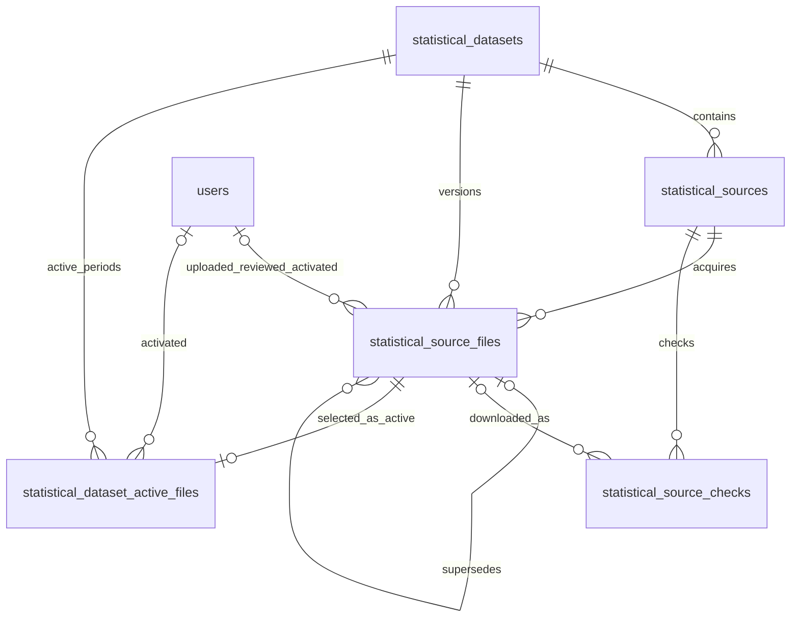

# ПРИЗМА Индексы — план второго этапа MVP

Дата анализа: 6 августа 2026 года. Обновлено по результатам БЛОКА 2.1: 7 августа
2026 года.

Статус документа: БЛОК 2.1 реализован и проверен на отдельной MariaDB test schema.
API, downloader, scheduler и UI следующих блоков не создавались.

## 1. Цель и границы этапа

Цель второго этапа — создать изолированную модель статистических datasets, источников,
версий исходных XLSX и предметного журнала проверок, а затем добавить ручное и
автоматическое получение файлов с обязательным административным review.

Первый dataset:

- код: `producer_price_indices_by_product`;
- название: «Индексы цен производителей по товарам и товарным группам»;
- провайдер: Росстат;
- формат: XLSX;
- периодичность: monthly;
- территория MVP: Российская Федерация;
- классификатор: коды на основе ОКПД2;
- база сравнения MVP: к предыдущему месяцу;
- рабочий период: с 2021 года.

Вне второго этапа остаются разбор статистических значений, observations, импорт строк,
коэффициенты, пользовательский поиск, калькулятор, PDF/DOCX, публичная проверка,
автоматическая активация, потребительские индексы, средние цены и региональные расчёты.

## 2. Результаты инспекции репозитория

### 2.1. Наблюдаемое

- Worktree перед созданием этого документа был чистым.
- Backend первого этапа находится в `server/app/Domain/PriceIndices`.
- Frontend первого этапа находится в `client/src/modules/price-indices`.
- Таблицы, миграции и классы `statistical_*` отсутствуют.
- Все Price Indices API уже проходят через `auth:sanctum` и middleware
  `price_indices.access`, который допускает только точные роли `admin` и `superadmin`.
- Диск `local` указывает на `storage/app/private`; public storage для исходных XLSX не
  требуется.
- PHP extensions `fileinfo` и `zip` доступны локально.
- `phpoffice/phpspreadsheet` уже установлен, но для технической ZIP/XLSX-проверки и тем
  более для импорта значений на этом этапе использовать его не требуется.
- Scheduler проекта объявляется в `server/routes/console.php`. Найденный scheduler-код
  старого parser закомментирован и служит только историческим примером.
- В проекте не найден действующий pattern `Cache::lock` или job middleware
  `WithoutOverlapping`, поэтому блокировка Price Indices должна быть реализована и
  протестирована внутри собственного domain boundary.
- Существующие upload-сервисы местами читают файл целиком через `file_get_contents`.
  Для потенциально крупных XLSX этот pattern нельзя переносить: требуется потоковая
  обработка.
- UUID/public-id conventions неоднородны: встречаются UUID primary keys, UUID-поля и
  короткие string public IDs. Для Price Indices нужен единый явный convention.
- FormRequest и JsonResource используются, но находятся преимущественно в общих
  `app/Http` каталогах; новые Price Indices классы должны остаться внутри domain.

### 2.2. Не удалось подтвердить

Фактическая локальная MySQL/MariaDB schema не прочитана: локальный `.env` использует
hostname `db`, а Docker runtime во время анализа недоступен. Поэтому перед реализацией
БЛОКА 2.1 необходимо повторить read-only проверки:

```bash
docker compose ps
docker compose exec app php artisan migrate:status
docker compose exec app php artisan db:table users
```

Нельзя считать production schema идентичной миграциям репозитория без отдельной
проверки. По существующим миграциям подтверждено только то, что FK на `users` обычно
создаются через `foreignId()`.

### 2.3. Изолированность

Новые backend-классы должны находиться только в `server/app/Domain/PriceIndices`, кроме:

- additive migrations в `server/database/migrations`;
- idempotent seeder в `server/database/seeders` либо domain seeder с минимальной
  регистрацией;
- config в `server/config/price_indices.php`;
- точечного scheduler declaration в `server/routes/console.php`;
- расширения `server/routes/price_indices.php`;
- env defaults в `server/.env.example`.

Запрещены зависимости от Project, ProjectRevision, RevisionPublication, SmetaCalculator,
ReportService, materials, material_prices, price_lists, существующих price imports и
старого parser.

## 3. Предлагаемая структура backend

```text
server/app/Domain/PriceIndices/
├── Application/
│   ├── Datasets/
│   ├── Sources/
│   └── SourceFiles/
├── Domain/
│   ├── Datasets/
│   ├── Sources/
│   └── SourceFiles/
├── Infrastructure/
│   ├── RemoteSources/
│   └── Storage/
└── Http/
    ├── Controllers/
    ├── Requests/
    └── Resources/
```

Рекомендация для MVP: Eloquent models и PHP enums хранить в соответствующих
`Domain/*` каталогах, orchestration — в `Application/*`, filesystem и HTTP adapters — в
`Infrastructure/*`. Отдельный repository abstraction без второго persistence backend не
добавлять.

## 4. Модель данных



### 4.1. `statistical_datasets`

Поля из ТЗ сохраняются без смешения с source URL. Предлагаемые типы:

- `id`: unsigned bigint primary key;
- `public_id`: UUID, unique;
- `code`: varchar(128), unique;
- `name`: varchar(255);
- `description`: text nullable;
- `provider_code`: varchar(64);
- `provider_name`: varchar(255);
- `data_kind`: varchar(64);
- `frequency`: varchar(32);
- `classifier_code`: varchar(64) nullable;
- `territory_scope`: varchar(64);
- `is_enabled`: boolean default true;
- `automatic_check_enabled`: boolean default false;
- `check_schedule`: varchar(64) nullable;
- `metadata_json`: JSON nullable;
- timestamps.

Индексы:

- unique `code`;
- index `(is_enabled, automatic_check_enabled)` для scheduled selection.

`check_schedule` не должен содержать исполняемое выражение. На MVP это нормализованная
policy/config value, а не произвольный cron, интерпретируемый из БД.

### 4.2. `statistical_sources`

- `id`: unsigned bigint primary key;
- `public_id`: UUID, unique;
- `dataset_id`: FK → datasets, restrict on delete;
- `code`: varchar(128);
- `name`: varchar(255);
- URL/template fields: text nullable;
- `filename_template`: varchar(255) nullable;
- `http_method`: varchar(8), default `GET`;
- enabled flags: boolean;
- check timestamps: nullable UTC datetime/timestamp;
- `consecutive_failures`: unsigned integer default 0;
- `last_http_status`: unsigned small integer nullable;
- error fields: string/text nullable;
- `settings_json`: JSON nullable;
- timestamps.

Ограничения и индексы:

- unique `(dataset_id, code)`;
- index `(is_enabled, automatic_check_enabled, next_check_at)`;
- index `(dataset_id, is_enabled)`.

DELETE endpoint на втором этапе не создаётся. Dataset/source отключаются флагом, поэтому
FK не должны каскадно удалять предметную историю.

### 4.3. `statistical_source_files`

Типы соответствуют ТЗ. Активная версия не кодируется generated column в этой таблице:
источником истины служит отдельная active-pointer table, описанная ниже.

FK policy:

- `dataset_id`: restrict on delete;
- `source_id`: nullable, restrict on delete;
- user FKs: nullable, null on delete, чтобы удаление пользователя не уничтожало аудит;
- `supersedes_file_id`: nullable self-FK, restrict on delete.

Ограничения:

- unique `(dataset_id, sha256)`;
- reporting month — 1..12;
- year/month должны быть либо оба null, либо оба заполнены;
- активация запрещена без полного reporting period;
- source при наличии обязан принадлежать тому же dataset — это проверяется application
  service и тестом, поскольку обычный FK не выражает cross-table equality.

Индексы:

- `(dataset_id, reporting_year, reporting_month, status)`;
- `(source_id, detected_at)`;
- `(status, detected_at)`;
- unique `(dataset_id, sha256)` уже служит hash lookup.

Индекс по `source_url` на MVP не добавлять: TEXT prefix index не нужен подтверждённым
запросам, а дедупликация выполняется по SHA-256. При появлении поиска по URL лучше
добавить отдельный нормализованный URL hash, а не широкий prefix index.

### 4.4. `statistical_source_checks`

- `source_id`: FK restrict on delete;
- `downloaded_file_id`: nullable FK, null on delete;
- прочие поля — согласно ТЗ;
- unique UUID public ID;
- index `(source_id, started_at)`;
- index `(status, started_at)`;
- index `(downloaded_file_id)`.

Source check является предметным аудитом и не заменяется Laravel/system log.

## 5. Утверждённое решение: одна active-версия периода

Одной application transaction недостаточно: два конкурентных процесса могут оба пройти
проверку и записать `active`.

DB-гарантия реализована отдельной таблицей `statistical_dataset_active_files`:

- numeric bigint `id` и UUID `public_id`;
- FK `dataset_id` и `source_file_id` используют `RESTRICT`;
- nullable audit FK `activated_by_user_id` использует `SET NULL`;
- reporting year/month и activation time обязательны;
- unique `(dataset_id, reporting_year, reporting_month)` гарантирует один pointer;
- application invariant требует совпадения dataset/period и статуса source file
  `approved` либо `active`.

Activation transaction блокирует target, существующий pointer и текущий active file,
переводит предыдущий файл в `superseded`, новый — в `active`, затем атомарно переносит
pointer. Duplicate-key race преобразуется в доменный activation conflict.

## 6. Lifecycle исходного файла

Основной путь:

```text
valid temporary XLSX
  -> pending_review
  -> approved -> active -> superseded
  -> rejected
```

Разрешённые переходы должны быть заданы PHP enum/value object и единым service, без
произвольного `update(['status' => ...])` из controllers/jobs.

- `pending_review → approved` — фиксируется reviewer и время;
- `pending_review → rejected` — reviewer, время и обязательная причина;
- `approved → active` — только транзакцией activation service;
- `active → superseded` — только при активации замены того же периода;
- `rejected` и `superseded` — терминальные на MVP.

### Конфликт статусов из ТЗ

`stored_path`, `file_size` и `sha256` заданы как обязательные, но статусы `detected` и
`downloading` возникают до получения этих значений. Рекомендуемое решение:

- pre-download lifecycle хранить в `statistical_source_checks` (`running`, `discovered`,
  `downloaded`, `rejected`, `failed`);
- `statistical_source_files` создавать только после успешного download, hash и базовой
  проверки, сразу в `pending_review`;
- `detected`, `downloading` и `failed` оставить зарезервированными constants либо удалить
  из фактически разрешённых переходов до появления обоснованного сценария.

Альтернатива — сделать path/hash/size nullable, но она ослабляет инварианты сохранённой
версии и не рекомендуется без отдельного требования.

Validation status после успешного сохранения — `passed` либо `warning`. Невалидный файл
удаляется из temporary storage и фиксируется source check/error response без создания
source-file row. `pending` нужен только внутри операции, а не как долговременное состояние
готовой версии.

## 7. Activation transaction

Activation service должен:

1. начать DB transaction;
2. повторно загрузить target file `lockForUpdate()`;
3. проверить `approved`, полный period и принадлежность dataset;
4. заблокировать dataset или все rows периода в стабильном порядке;
5. найти текущую active-версию;
6. перевести её в `superseded`;
7. установить новой версии `active`, `supersedes_file_id`, администратора и время;
8. завершить transaction;
9. обработать unique violation как conflict, не как 500.

Файл и `stored_path` при активации не меняются. Повторная активация уже active-файла
может быть идемпотентной только для того же администратора/состояния; попытка активировать
rejected/superseded должна возвращать conflict.

## 8. Private storage и базовая XLSX-проверка

Целевой disk — `local` (`storage/app/private`). Предлагаемый путь:

```text
price-indices/source-files/{dataset_code}/{year}/{month}/{public_id}.xlsx
```

Для неизвестного периода до review использовать сегменты `unknown/unknown`. Исходное имя
сохраняется только как metadata и никогда не участвует в физическом пути.

Pipeline:

1. принять upload/remote stream во временный уникальный файл;
2. потоково считать bytes, размер и SHA-256;
3. проверить extension, MIME и ZIP signature `PK`;
4. открыть через `ZipArchive` без распаковки в public directory;
5. проверить normalized entry names, запрет `..`, absolute paths, backslashes и macros;
6. проверить `[Content_Types].xml` и `xl/workbook.xml`;
7. применить limits: entries, individual/total uncompressed size и compression ratio;
8. проверить unique `(dataset_id, sha256)`;
9. зарезервировать DB row и переместить файл в final private path;
10. при любой ошибке удалить temp, а при DB commit failure компенсирующе удалить final.

DB и filesystem не имеют общей транзакции. Поэтому service обязан иметь явную
compensation-логику и тесты на storage failure, duplicate race и DB failure. Существующий
pattern `file_get_contents` не использовать.

Macros отклоняются по наличию `vbaProject.bin`, macro-enabled content types и других
запрещённых executable/embedded entries. Конкретные numeric limits должны находиться в
`config/price_indices.php`, не в коде.

## 9. Manual upload

Оба acquisition methods используют один ingestion service. Manual endpoint передаёт:

- dataset;
- nullable source;
- year/month;
- nullable source URL;
- XLSX file;
- nullable comment.

После проверки создаётся версия `manual_upload`, `pending_review`, без парсинга листов и
без активации. Duplicate hash возвращает HTTP 409 и public ID/ссылку существующей версии.

FormRequest выполняет поверхностную validation размера/extension/MIME, но не заменяет
binary validator. API Resource никогда не возвращает `stored_path` как публичный URL.
Скачивание идёт только через защищённый controller и private disk response.

## 10. Remote source checker и SSRF boundary

Remote checker должен быть отдельным Infrastructure adapter. Требования:

- только HTTPS;
- exact allowlist host `rosstat.gov.ru` на MVP; subdomains разрешать только отдельными
  entries, не неявным suffix match;
- запрет credentials/userinfo и нестандартных схем;
- DNS resolve до соединения; отклонение loopback, private, link-local, multicast,
  documentation/reserved IPv4 и IPv6 ranges;
- IP проверяется заново для каждого redirect;
- redirects обрабатываются вручную, максимум задаётся config;
- защита от DNS rebinding требует pinning проверенного IP на время запроса при сохранении
  TLS hostname verification; этот механизм должен быть доказан integration test;
- timeout/connect timeout и максимальный response size задаются config;
- Content-Length проверяется до download, фактические bytes — во время stream;
- Content-Type является сигналом, но окончательное решение принимает binary validator;
- cookies, Authorization и секретные headers не пересылаются по redirects;
- partial temp file удаляется при timeout/overflow/error.

Laravel HTTP client с обычным `get()` может буферизовать ответ. Нужен adapter на его
Guzzle options (`sink`, manual redirects, progress/byte limit) либо прямой PSR/Guzzle
stream, но без новой зависимости. Automated tests используют `Http::fake`; отдельные
unit-тесты валидатора URL/IP не должны зависеть от реального DNS.

Один source check создаётся в `running`, затем завершается одним из terminal statuses.
Source file создаётся только для нового hash. Тот же URL с новым hash создаёт новую
версию; тот же hash даёт `unchanged` и не дублирует файл.

## 11. URL templates и периоды

Template renderer разрешает только whitelist tokens:

- `{month}`;
- `{month2}`;
- `{year}`;
- `{previous_month}`;
- `{previous_year}`.

Неизвестный token, незакрытая скобка или получившийся не-HTTPS URL — validation error.
`eval`, Blade и произвольные expressions запрещены.

Monthly period resolver возвращает ограниченный deduplicated список:

1. предполагаемый текущий отчётный период;
2. предыдущий период;
3. последний active period для обнаружения замены.

Publication lag нельзя угадывать. Рекомендуется хранить в `settings_json` source значения
`automatic_check_start_date` и `publication_lag_months`, валидируемые отдельным DTO.
Количество candidates ограничивается config.

Точный `download_url_template` и `filename_template` первого источника остаются
неопределёнными до анализа нескольких реальных файлов Росстата. Seeder не должен их
придумывать.

## 12. Effective automatic-check policy

Проверка запускается только если одновременно true:

```text
PRICE_INDICES_ENABLED
AND PRICE_INDICES_SOURCE_CHECKS_ENABLED
AND dataset.is_enabled
AND dataset.automatic_check_enabled
AND source.is_enabled
AND source.automatic_check_enabled
AND source.next_check_at <= now
```

Глобальный scheduler вызывает `price-indices:check-sources` раз в сутки в configured
timezone. Command выбирает due sources и dispatches один job на source/period set.

Lock key должен включать source ID. TTL должен превышать HTTP timeout и иметь безопасный
верхний предел. Command-level `--force` может обходить due time, но не distributed lock и
не SSRF/file limits. `--dry-run` не создаёт checks/files, не скачивает файл и показывает
только выбранные sources/candidates.

`withoutOverlapping()` и `onOneServer()` безопасны только на cache store с atomic shared
locks. Перед production включением требуется проверить cache driver; scheduler остаётся
выключенным по умолчанию. Наличие cron `php artisan schedule:run` или отдельного scheduler
container документируется, но infrastructure автоматически не меняется.

## 13. Admin API plan

Endpoints из ТЗ добавляются в существующий `routes/price_indices.php` под `/admin` и
общими middleware `auth:sanctum`, `price_indices.access`. Дополнительный broad admin
middleware не должен ослабить exact-role правило первого этапа.

Правила:

- route model binding — по UUID `public_id`, внутренние numeric IDs не раскрывать;
- все mutations — FormRequest;
- responses — JsonResource;
- list endpoints — pagination и явные filters/sort whitelist;
- lifecycle actions вызывают application services;
- download проверяет access и отдаёт private stream;
- arbitrary URL не принимается user-facing API;
- raw paths, internal errors, headers/cookies не возвращаются.

Dataset/source DELETE endpoints отсутствуют. Source URL/template редактирует только
допущенный администратор.

## 14. Admin UI plan

Весь предметный frontend-код остаётся в
`client/src/modules/price-indices/admin`. Существующие `AdminLayout`, shared page
components, theme roles и density сохраняются.

### Sources

Заменить заглушку list/detail UI с dataset/source status, check timestamps, HTTP status и
failures. Actions: create, edit, enable/disable, check now, history.

### Imports XLSX

Название страницы сохраняется, но UI явно говорит «Версии файлов источника». Показать
period, acquisition, filename, URL, size, short SHA, timestamps, validation/lifecycle,
reviewer и active marker. Actions должны вычисляться из lifecycle, не только роли.

### Logs

Отдельный source-check list с filters source/status/date, pagination и error states. Не
использовать system log.

### Mappings

Остаётся заглушкой. Mapper, preview листов и fake columns не добавляются.

Новые frontend test dependencies не устанавливаются. Pure helpers/stores/API adapters
покрывают pagination, filters, empty/error states и action visibility; component tests
заявляются только при фактическом mount.

## 15. Seeder первого dataset

Seeder создаёт только dataset и не регистрируется для автоматического production run.
Рекомендуется `firstOrCreate(['code' => ...], defaults)`, а не `updateOrCreate`, чтобы
повторный запуск не перезаписывал административные настройки существующей записи.

Source, URL page, download template и filename template seeder не создаёт.

## 16. Наблюдаемость

Domain events/log context:

- source check started/completed;
- new file discovered;
- hash unchanged;
- same URL replaced by new hash;
- technical validation failed;
- source file approved/rejected/activated.

Предметная история хранится в source checks/file lifecycle, оперативная диагностика — в
Laravel log. Не логируются файл, cookies, authorization headers, secrets и полный response
body. URL перед логированием очищается от userinfo и чувствительных query parameters.

## 17. План реализации по блокам

### БЛОК 2.1 — schema, models, lifecycle

В scope:

- пять additive migrations;
- пять Eloquent models и relations;
- PHP enums/status transition policy;
- activation service с transaction/locking;
- active-pointer uniqueness на уровне DB;
- idempotent dataset seeder;
- factories и migration/model/lifecycle tests.

Out of scope: filesystem, upload API, HTTP downloader, command/job, UI.

Acceptance:

- таблицы и все FK/indexes созданы;
- duplicate code/hash отклоняются DB;
- period constraints проверяются;
- только один active file на dataset+period;
- activation supersedes previous row атомарно;
- exact roles первого этапа не изменены;
- seeder не создаёт source URL;
- rollback проверен на пустой schema.

### БЛОК 2.2 — private storage, manual upload, admin API

В scope:

- streaming hash/temp/final storage service;
- XLSX ZIP validator и limits;
- manual upload;
- dataset/source/source-file CRUD без DELETE;
- review/activate/download actions;
- Requests/Resources и conflict contract;
- tests storage failure, invalid XLSX, size/ZIP limits, duplicate race.

Out of scope: remote HTTP, jobs, scheduler, mapper/import, UI.

### БЛОК 2.3 — remote checker, command, job, history

В scope:

- strict template and period services;
- SSRF-safe streaming downloader;
- source-check application service;
- one-source queue job;
- `price-indices:check-sources` со всеми options;
- check/list/check-now endpoints;
- `Http::fake` security and behavior tests;
- distributed lock tests.

Out of scope: scheduler registration and UI.

### БЛОК 2.4 — admin UI

В scope:

- sources list/editor/check history;
- source-file versions/upload/review/activation;
- logs filters/pagination;
- stores/API/types/pure helper tests;
- desktop/mobile/light/dark smoke plan.

Mappings остаётся заглушкой. Пользовательский `/app/indices` не расширяется.

### БЛОК 2.5 — scheduler, документация, regression

В scope:

- config/env defaults для source checks;
- daily schedule with overlap/one-server guards;
- scheduler requirements и cron/container documentation;
- `docs/PRICE_INDICES_PHASE_2_SOURCE_MODEL.md`;
- backend/frontend/full Git regression и browser smoke при доступном runtime.

Production infrastructure и flags автоматически не включаются.

## 18. Migration и rollback strategy

### Forward

1. Проверить фактическую DB version/schema и duplicates table names.
2. Создать datasets.
3. Создать sources.
4. Создать source files с self-FK/uniques.
5. Создать source checks.
6. Запустить constraints tests на той же DB family, что production.
7. Отдельно запустить seeder только в явно выбранном окружении.

Все изменения additive; существующие estimate tables не затрагиваются, backfill не
нужен.

### Rollback

Технический `down()` удаляет новые таблицы в обратном порядке:

1. active files;
2. source checks;
3. source files;
4. sources;
5. datasets.

Это безопасно только до появления реальных source-file records. После БЛОКА 2.2
production rollback должен откатывать код/flags, но сохранять таблицы и private files.
Автоматическое удаление файлов из migration `down()` запрещено. Destructive rollback
после накопления данных требует backup, явного approval и отдельной процедуры.

## 19. Проверки по блокам

До миграций БЛОКА 2.1:

```bash
docker compose exec app php artisan migrate:status
docker compose exec app php artisan db:table users
docker compose exec app php artisan migrate --pretend
```

Targeted backend checks:

```bash
php artisan test --filter=PriceIndices
php artisan route:list --path=api/indices
php artisan list --raw | findstr price-indices
php -l <каждый новый PHP-файл>
```

Frontend blocks:

```bash
npm run test:unit
npm run build-only -- --logLevel error
npm run type-check
```

Нельзя выполнять реальные HTTP-запросы к Росстату в automated tests. Миграции нельзя
запускать на рабочей БД без отдельной команды.

## 20. Статус архитектурных решений

В БЛОКЕ 2.1 утверждены и реализованы:

1. отдельная active-pointer table вместо generated column;
2. lifecycle source-file начинается с `pending_review`, технические состояния принадлежат
   source checks;
3. UUID `public_id` как route key всех пяти моделей при numeric bigint internal PK;
4. `restrictOnDelete` для dataset/source/source-file history и `nullOnDelete` для user FKs.

В БЛОКЕ 2.2 утверждены и реализованы:

5. XLSX upload/download limit 64 MiB, ZIP entries 5000, single entry 64 MiB, total
   uncompressed 512 MiB и compression ratio 200;
6. private storage, retention без автоматического удаления и единый ingestion pipeline.

Для следующих блоков остаётся утвердить:

7. Утвердить exact-host allowlist semantics и механизм DNS pinning.
8. Утвердить publication lag и settings schema до реализации period resolver.
9. Подтвердить, что dataset `check_schedule` — policy value, а не произвольный DB cron.

## 21. Риски

- DNS rebinding и redirects могут обойти поверхностный host check.
- ZIP bomb может исчерпать CPU/disk даже без распаковки при неверных limits.
- DB/filesystem failure между move и commit может оставить orphan file.
- Concurrent duplicate upload/check требует обработки unique violation и cleanup.
- Concurrent activation обрабатывается unique active-pointer constraint; реальный
  parallel-transaction test пока не добавлен.
- `onOneServer` не даёт распределённой гарантии на неподходящем cache driver.
- Неизвестный publication lag создаст неверные candidate URLs.
- Реальные Росстат Content-Type/redirect/filename patterns пока не подтверждены.
- Migration tests должны оставаться на MariaDB: SQLite не подтверждает CHECK/FK semantics.
- Physical rollback после накопления файлов приведёт к потере аудиторского следа.
- Слишком подробные error logs могут раскрыть URL query secrets или инфраструктуру.

## 22. Рекомендуемый следующий блок

Следующим может быть только отдельно утверждённый БЛОК 2.3. До его начала следует
утвердить exact-host allowlist, DNS pinning/redirect policy и не расширять проверенные
schema/lifecycle/ingestion контракты БЛОКОВ 2.1–2.2 без отдельного решения.

## 23. Фактический результат БЛОКА 2.1

- production-like DB: MariaDB `10.6.24-MariaDB-ubu2204`;
- test DB: отдельная schema `smeta_test` из `server/.env.testing`;
- из-за baseline migration ledger полный `migrate` не запускался: применялись только пять
  новых migration paths;
- MariaDB CHECK constraints `stat_files_month_chk` и `stat_files_period_pair_chk`
  фактически созданы и проверены constraint tests;
- предметные даты реализованы как `DATETIME`: обязательный `TIMESTAMP detected_at` был
  отклонён MariaDB из-за implicit-default semantics;
- migrate/rollback прошли; rollback удалил таблицы строго в порядке active files, checks,
  files, sources, datasets, после чего пять миграций повторно применены к test DB;
- `php artisan test --env=testing --filter=PriceIndices`: 43 passed, 129 assertions;
- production schema `smeta_expert` не изменялась;
- filesystem, XLSX parsing, HTTP, jobs, scheduler, frontend, observations и billing не
  изменялись.

## 24. Фактический результат БЛОКА 2.2

### Config и private storage

- `source_files.max_upload_bytes` и `max_download_bytes`: `67108864` (64 MiB);
- `xlsx.max_zip_entries`: `5000`;
- `xlsx.max_single_entry_uncompressed_bytes`: `67108864`;
- `xlsx.max_total_uncompressed_bytes`: `536870912`;
- `xlsx.max_compression_ratio`: `200`;
- disk: существующий private `local` (`storage/app/private`);
- temp: `price-indices/tmp/{uuid}.upload`;
- final: `price-indices/source-files/{dataset_code}/{year}/{month}/{public_id}.xlsx`;
- период без year/month использует `unknown/unknown`;
- original filename не используется как physical name, `stored_path` не публикуется.

### Validator, hash и ingestion

- проверяются размер, extension, MIME, ZIP signature/open, число и безопасные имена
  entries, individual/total uncompressed size и compression ratio;
- обязательны `[Content_Types].xml` и `xl/workbook.xml`;
- macro-enabled content, `vbaProject.bin`, executable extensions, `xl/embeddings` и
  `xl/activeX` отклоняются без распаковки архива;
- SHA-256 и размер вычисляются через `hash_update_stream`; отдельный тест использует
  synthetic 24 MiB file;
- ingestion проверяет dataset/source и period pair, валидирует XLSX, вычисляет hash,
  предотвращает duplicate dataset+SHA-256, создаёт `pending_review` row, перемещает файл
  и только затем commit;
- DB insert/move/commit failure и duplicate race имеют compensating cleanup temp/final;
  ошибки не подавляются, исходное исключение сохраняется в chain.

### Admin API и error contract

- зарегистрировано 15 endpoints для datasets, sources, source files, upload,
  approve/reject/activate и private streamed download;
- route model binding использует UUID `public_id`;
- Resources не возвращают numeric ID, `stored_path` или absolute paths;
- stable codes включают XLSX/security errors, `duplicate_file`, `storage_failure`,
  `invalid_period`, `source_dataset_mismatch`, `immutable_dataset_code` и
  `invalid_lifecycle`;
- duplicate/lifecycle/activation/immutable conflicts возвращают 409, validation — 422,
  неизвестный UUID и отсутствующий binary — 404;
- DELETE endpoints отсутствуют; valid pending/approved/active/superseded/rejected files
  сохраняются, technical-invalid uploads не создают DB row и сразу удаляются.

### Проверки и ограничения

- `PriceIndicesAdminApiTest`: 8 passed, 84 assertions;
- полный `php artisan test --env=testing --filter=PriceIndices`: 70 passed,
  271 assertions;
- `route:list --path=api/indices/admin`: 15 routes;
- PHP syntax: без ошибок для PriceIndices app/tests, config и routes;
- `docker/app/php.ini` содержит `upload_max_filesize=64M`, `post_max_size=72M`;
- локальный rebuild `app` предпринимался через BuildKit и classic builder, но Docker
  orchestration зависает до первого build-step; running container не пересоздан и всё ещё
  сообщает `5M/5M`. Для фактического применения требуется исправить Docker Desktop/build
  state и повторить rebuild/recreate;
- production DB/migrations, frontend, billing, remote HTTP, jobs, scheduler, mapping и
  observations не изменялись; новые зависимости не добавлялись.

## 25. Roadmap update after БЛОК 2.2

Roadmap changed after Block 2.2: automatic source acquisition deferred until the manual
import/calculation workflow is validated. Исторический план downloader сохранён выше;
актуальный следующий шаг — отдельно утверждаемый manual XLSX import flow.
